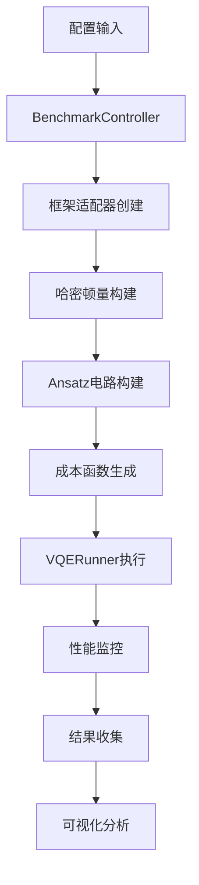

# VQE框架性能基准测试脚本使用指南

## 📋 脚本概述

### 核心目的

[`vqe_bench_new.py`](vqe_bench_new.py) 是一个专业的量子计算框架性能对比工具，旨在精确评估Qibo、Qiskit、PennyLane三大主流量子计算框架在变分量子本征求解器(VQE)算法上的性能差异。

### 科学问题

本脚本专注于解决**横向场伊辛模型(Transverse Field Ising Model, TFIM)**的基态能量计算问题，这是量子多体物理中的经典模型，也是测试量子算法性能的标准基准。

### 对比维度

脚本从以下几个关键维度对比框架性能：

- **计算精度**：最终结果与精确解的误差
- **收敛速度**：达到预设精度所需的迭代次数
- **运行时间**：总执行时间和单步执行时间
- **资源消耗**：内存使用和CPU利用率

### 适用场景

- 量子计算框架选型决策
- 框架性能优化研究
- 学术论文中的性能对比数据
- 量子算法开发中的性能评估

---

## 🚀 快速开始

### 环境配置

#### 基础环境要求

```bash
# Python版本要求
Python >= 3.8

# 必需的依赖包
pip install numpy matplotlib psutil
```

#### 框架安装

根据需要测试的框架安装相应依赖：

```bash
# 安装Qibo
pip install qibo>=0.2.21

# 安装Qiskit
pip install qiskit>=1.4.4

# 安装PennyLane
pip install pennylane>=0.33.0
```

#### 完整依赖安装

```bash
# 安装所有依赖
pip install -r requirements.txt
```

### 最简单的运行方式

```python
# 直接运行脚本
python vqe_bench_new.py
```

这将使用默认配置进行一次快速测试，对比三个框架在4、6、8量子比特下的性能。

### 自定义配置运行

```python
from vqe_config import merge_configs
from vqe_bench_new import BenchmarkController

# 获取默认配置
config = merge_configs()

# 自定义配置
config["n_qubits_range"] = [4, 6]  # 测试4和6量子比特
config["frameworks_to_test"] = ["Qiskit", "Qibo"]  # 只测试两个框架
config["n_runs"] = 5  # 每个测试运行5次

# 运行基准测试
controller = BenchmarkController(config)
results = controller.run_all_benchmarks()
```

---

## ⚙️ 参数调整指南

### 核心参数说明

#### 1. 问题规模设置

```python
# 测试的量子比特数范围
"n_qubits_range": [4, 6, 8]  # 从小到大，避免内存溢出
```

**建议**：首次使用时选择较小的量子比特数(4-6)，确认环境正常后再增加规模。

#### 2. 框架选择

```python
# 要测试的框架列表
"frameworks_to_test": ["Qiskit", "PennyLane", "Qibo"]
```

**可选框架**：
- `"Qiskit"` - IBM的量子计算框架
- `"PennyLane"` - Xanadu的量子机器学习框架
- `"Qibo"` - 专注于高性能的量子计算框架

#### 3. 算法选择

```python
# VQE ansatz类型
"ansatz_type": "HardwareEfficient"  # 或 "QAOA"
```

**可选类型**：
- `"HardwareEfficient"` - 硬件高效ansatz，通用性强
- `"QAOA"` - 量子近似优化算法，适合组合优化问题

#### 4. 优化器设置

```python
# 经典优化器选择
"optimizer": "COBYLA"  # 可选: "SPSA", "L-BFGS-B"
```

**优化器特点**：
- `"COBYLA"` - 无梯度优化器，适合参数空间大的问题
- `"SPSA"` - 模拟梯度优化器，适合噪声环境
- `"L-BFGS-B"` - 精确梯度优化器，适合光滑问题

#### 5. 测试可靠性

```python
# 每个配置的运行次数
"n_runs": 3  # 建议快速测试用3次，正式测试用10次或更多
```

### 高级参数调整

#### 物理模型参数

```python
"problem": {
    "j_coupling": 1.0,      # 自旋间相互作用强度
    "h_field": 1.0,         # 横向场强度
    "boundary_conditions": "periodic"  # 或 "open"
}
```

#### Ansatz结构参数

```python
"ansatz_details": {
    "n_layers": 4,                    # ansatz层数
    "entanglement_style": "linear"    # 纠缠模式: "linear", "circular", "full"
}
```

#### 优化器参数

```python
"optimizer_details": {
    "max_evaluations": 500,    # 最大函数评估次数
    "accuracy_threshold": 1e-4, # 收敛阈值
    "options": {
        "COBYLA": {"tol": 1e-5, "rhobeg": 1.0}
    }
}
```

---

## 🏗️ 技术架构说明

### 核心模块结构

```
vqe_bench_new.py
├── 参数管理模块 (统一参数生成、验证)
├── 性能监控模块 (内存、CPU监控)
├── FrameworkWrapper抽象基类 (框架适配器接口)
├── 具体框架适配器 (QiskitWrapper, PennyLaneWrapper, QiboWrapper)
├── VQERunner执行引擎 (VQE优化循环)
├── BenchmarkController控制器 (整体测试流程)
└── VQEBenchmarkVisualizer可视化器 (结果分析)
```

### 数据流设计



### 关键设计决策

#### 1. 分层配置系统

- **核心用户层**：最常用参数，30秒内可理解
- **高级研究层**：专家级设置，用于深入测试

#### 2. 框架适配器模式

使用抽象基类[`FrameworkWrapper`](vqe_bench_new.py:231)统一不同框架的接口，确保测试的公平性和一致性。

#### 3. 统一参数生成

通过[`generate_uniform_initial_params()`](vqe_bench_new.py:69)函数确保所有框架使用相同的初始参数，消除初始化偏差。

#### 4. 实时性能监控

- **内存监控**：[`MemoryMonitor`](vqe_bench_new.py:134)线程实时跟踪内存使用
- **CPU监控**：[`CPUMonitor`](vqe_bench_new.py:175)线程记录CPU利用率
- **时间分解**：区分量子计算时间和经典优化时间

---

## 📊 结果解读

### 输出文件说明

测试完成后，会在指定目录生成以下文件：

```
benchmark_results_high_performance/
├── vqe_benchmark_YYYYMMDD_HHMMSS.json  # 完整测试数据
└── vqe_benchmark_dashboard_YYYYMMDD_HHMMSS.png  # 可视化仪表盘
```

### 可视化仪表盘解读

生成的仪表盘包含7个核心图表：

1. **求解时间对比** - 各框架在不同量子比特数下的总执行时间
2. **内存扩展性** - 峰值内存使用随量子比特数的变化
3. **收敛轨迹** - 能量随优化迭代的变化过程
4. **评估次数** - 达到收敛所需的函数调用次数
5. **最终精度** - 各框架的最终计算误差
6. **时间分解** - 量子计算时间与经典优化时间的比例
7. **CPU利用率** - 各框架的CPU使用效率

### 关键性能指标

- **收敛率**：成功达到预设精度的运行次数比例
- **求解时间**：从开始到收敛的总时间
- **最终误差**：计算结果与精确解的相对误差
- **内存效率**：峰值内存使用量
- **CPU利用率**：CPU使用百分比

---

## ⚠️ 注意事项和排错指南

### 常见问题及解决方案

#### 1. 导入错误

**问题**：`ModuleNotFoundError: No module named 'qibo'`

**解决方案**：
```bash
# 确认框架已正确安装
pip install qibo

# 如果仍有问题，尝试重新安装
pip uninstall qibo
pip install qibo>=0.2.21
```

#### 2. 内存不足

**问题**：`MemoryError` 或系统响应缓慢

**解决方案**：
```python
# 减小测试规模
config["n_qubits_range"] = [4, 6]  # 减少量子比特数
config["ansatz_details"]["n_layers"] = 2  # 减少层数

# 设置内存限制
config["system"]["max_memory_mb"] = 4096  # 4GB限制
```

#### 3. 框架初始化失败

**问题**：某个框架无法初始化

**解决方案**：
```python
# 从测试列表中移除有问题的框架
config["frameworks_to_test"] = ["Qiskit", "Qibo"]  # 移除PennyLane

# 或者只测试一个框架
config["frameworks_to_test"] = ["Qibo"]
```

#### 4. 收敛困难

**问题**：所有框架都无法达到预设精度

**解决方案**：
```python
# 放宽收敛阈值
config["optimizer_details"]["accuracy_threshold"] = 1e-3  # 从1e-4放宽到1e-3

# 增加最大评估次数
config["optimizer_details"]["max_evaluations"] = 1000  # 从500增加到1000

# 更换优化器
config["optimizer"] = "SPSA"  # 尝试不同的优化器
```

#### 5. 运行时间过长

**问题**：单个测试运行时间超过预期

**解决方案**：
```python
# 减少运行次数
config["n_runs"] = 1  # 从3减少到1

# 设置时间限制
config["system"]["max_time_seconds"] = 300  # 5分钟限制

# 减少测试点
config["n_qubits_range"] = [4]  # 只测试4量子比特
```

### 性能调优建议

#### 1. 硬件优化

- **CPU**：多核处理器能显著提升性能
- **内存**：至少8GB RAM，推荐16GB或更多
- **存储**：SSD硬盘能加快结果写入速度

#### 2. 软件配置

```python
# Qibo高性能配置
"backend_details": {
    "framework_backends": {
        "Qibo": {"backend": "qibojit", "platform": "numba"}
    }
}

# PennyLane高性能配置
"backend_details": {
    "framework_backends": {
        "PennyLane": "lightning.qubit"
    }
}
```

#### 3. 测试策略

- **渐进式测试**：从小规模开始，逐步增加复杂度
- **单框架验证**：先确保单个框架正常工作，再进行对比
- **参数调优**：根据具体问题调整ansatz层数和优化器参数

### 扩展方法

#### 添加新的量子框架

1. 创建新的框架适配器类，继承[`FrameworkWrapper`](vqe_bench_new.py:231)
2. 实现所有抽象方法：
   - [`setup_backend()`](vqe_bench_new.py:248)
   - [`build_hamiltonian()`](vqe_bench_new.py:261)
   - [`build_ansatz()`](vqe_bench_new.py:275)
   - [`get_cost_function()`](vqe_bench_new.py:289)
   - [`get_param_count()`](vqe_bench_new.py:305)

3. 在[`BenchmarkController._create_wrappers()`](vqe_bench_new.py:1015)中添加新框架

#### 添加新的测试问题

1. 在[`build_hamiltonian()`](vqe_bench_new.py:261)方法中添加新的哈密顿量构建逻辑
2. 更新[`calculate_exact_energy()`](vqe_bench_new.py:1593)函数以支持新问题
3. 在配置文件中添加新问题的参数选项

---

## 📝 实用代码示例

### 示例1：快速性能验证

```python
from vqe_config import get_quick_start_config
from vqe_bench_new import BenchmarkController

# 使用快速开始配置
config = get_quick_start_config()

# 运行测试
controller = BenchmarkController(config)
results = controller.run_all_benchmarks()

print("快速测试完成！")
```

### 示例2：自定义性能评估

```python
from vqe_config import merge_configs
from vqe_bench_new import BenchmarkController, VQEBenchmarkVisualizer

# 创建自定义配置
config = merge_configs(
    core_config={
        "n_qubits_range": [4, 6, 8],
        "frameworks_to_test": ["Qiskit", "Qibo"],
        "ansatz_type": "HardwareEfficient",
        "optimizer": "COBYLA",
        "n_runs": 5,
        "experiment_name": "Custom_Performance_Test"
    },
    advanced_config={
        "ansatz_details": {"n_layers": 3},
        "optimizer_details": {"max_evaluations": 800},
        "system": {"save_results": True}
    }
)

# 运行测试
controller = BenchmarkController(config)
results = controller.run_all_benchmarks()

# 生成可视化
visualizer = VQEBenchmarkVisualizer(results, config)
visualizer.plot_dashboard("./my_results/")
```

### 示例3：单一框架深度测试

```python
from vqe_config import merge_configs
from vqe_bench_new import BenchmarkController

# 只测试Qibo框架
config = merge_configs(
    core_config={
        "n_qubits_range": [4, 6, 8, 10, 12],
        "frameworks_to_test": ["Qibo"],
        "n_runs": 10,
        "experiment_name": "Qibo_Deep_Analysis"
    },
    advanced_config={
        "backend_details": {
            "framework_backends": {
                "Qibo": {"backend": "qibojit", "platform": "numba"}
            }
        },
        "optimizer_details": {
            "max_evaluations": 1500,
            "accuracy_threshold": 1e-5
        }
    }
)

# 运行深度测试
controller = BenchmarkController(config)
results = controller.run_all_benchmarks()
```

### 示例4：优化器对比测试

```python
from vqe_config import merge_configs
from vqe_bench_new import BenchmarkController

# 测试不同优化器的性能
optimizers = ["COBYLA", "SPSA", "L-BFGS-B"]
all_results = {}

for optimizer in optimizers:
    config = merge_configs(
        core_config={
            "n_qubits_range": [6, 8],
            "frameworks_to_test": ["Qibo"],
            "optimizer": optimizer,
            "n_runs": 5,
            "experiment_name": f"Optimizer_Comparison_{optimizer}"
        }
    )
    
    controller = BenchmarkController(config)
    results = controller.run_all_benchmarks()
    all_results[optimizer] = results

# 分析结果
for optimizer, results in all_results.items():
    print(f"{optimizer} 优化器结果:")
    for n_qubits in [6, 8]:
        if "Qibo" in results and n_qubits in results["Qibo"]:
            data = results["Qibo"][n_qubits]
            print(f"  {n_qubits} 量子比特: 收敛率 {data['convergence_rate']:.1%}, "
                  f"平均时间 {data['avg_time_to_solution']:.3f}s")
```

---

## 🔧 高级功能

### 精确能量缓存

脚本内置了精确能量缓存机制，避免重复计算：

```python
from vqe_bench_new import print_cache_status, clear_exact_energy_cache

# 查看缓存状态
print_cache_status()

# 清空缓存
clear_exact_energy_cache()
```

### 参数一致性验证

```python
from vqe_bench_new import validate_parameter_consistency, generate_uniform_initial_params

# 生成测试参数
test_params = generate_uniform_initial_params(n_qubits=6, n_layers=4)

# 验证参数一致性
validation_results = validate_parameter_consistency(
    framework_results={"Qibo": {"param_count": 48}},
    n_qubits=6,
    n_layers=4,
    test_params=test_params
)
```

### 自定义可视化

```python
from vqe_bench_new import VQEBenchmarkVisualizer
import matplotlib.pyplot as plt

# 创建可视化器
visualizer = VQEBenchmarkVisualizer(results, config)

# 单独绘制某个图表
fig, ax = plt.subplots(1, 1, figsize=(10, 6))
visualizer._plot_time_to_solution(ax)
plt.show()
```

---

## 📚 参考资料

### 相关文档

- [`vqe_config.py`](vqe_config.py) - 配置系统详细说明
- [`vqe_design.ipynb`](vqe_design.ipynb) - 设计思路和架构决策
- [`README.md`](README.md) - 项目总体介绍

### 学术背景

- VQE算法原理：Peruzzo et al., "A Variational Eigenvalue Solver on a Photonic Quantum Processor", Nature Communications, 2014
- 横向场伊辛模型：Sachdev, "Quantum Phase Transitions", Cambridge University Press, 2011

### 框架文档

- [Qibo官方文档](https://qibo.science/)
- [Qiskit官方文档](https://qiskit.org/)
- [PennyLane官方文档](https://pennylane.ai/)

---

## 🎯 最佳实践总结

1. **从小规模开始**：首次使用时选择小量子比特数(4-6)，确认环境正常
2. **逐步增加复杂度**：先验证单个框架，再进行多框架对比
3. **合理设置资源限制**：根据硬件配置设置内存和时间限制
4. **多次运行取平均**：建议每个配置运行5-10次以获得统计意义
5. **保存测试结果**：启用结果保存功能，便于后续分析
6. **定期更新依赖**：保持量子计算框架为最新版本以获得最佳性能

---

## 📞 获取帮助

如果在使用过程中遇到问题：

1. 检查本文档的"注意事项和排错指南"部分
2. 查看终端输出的详细错误信息
3. 确认所有依赖包已正确安装
4. 尝试简化配置参数进行测试

**记住**：这个脚本是为未来的你设计的工具，保持文档的更新和记录你的使用经验，会让它在未来更加有用！