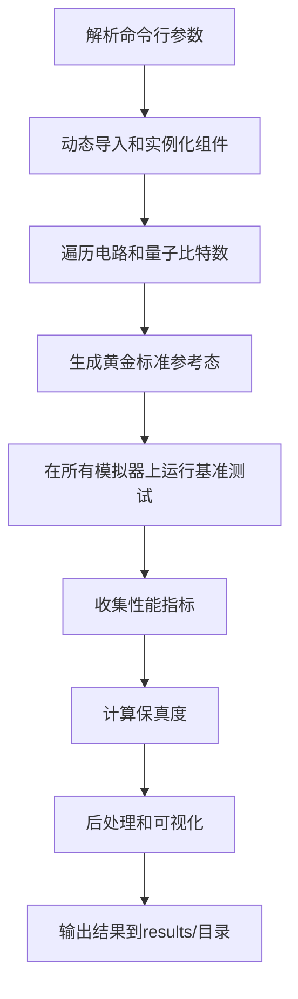

# 量子模拟器基准测试平台 - 项目架构设计

## 项目概述

本项目旨在创建一个模块化、可扩展的基准测试平台，用于系统性地评估Qibo量子模拟器在不同后端下的性能，通过与Qiskit、PennyLane等行业标准框架进行严谨的横向对比，来识别性能瓶颈。

## 项目结构

```
Bench/
├── benchmark_harness/           # 核心基准测试框架
│   ├── __init__.py
│   ├── abstractions.py          # 抽象接口和数据结构定义
│   ├── metrics.py               # 性能指标收集器
│   ├── post_processing.py       # 结果后处理与可视化
│   ├── simulators/              # 模拟器封装器
│   │   ├── __init__.py
│   │   ├── qibo_wrapper.py      # Qibo模拟器封装
│   │   ├── qiskit_wrapper.py    # Qiskit模拟器封装
│   │   └── pennylane_wrapper.py # PennyLane模拟器封装
│   └── circuits/                # 基准测试电路
│       ├── __init__.py
│       └── qft.py               # 量子傅里叶变换电路
├── tests/                       # 测试套件
│   ├── __init__.py
│   ├── test_abstractions.py     # 抽象层测试
│   ├── test_metrics.py          # 指标收集器测试
│   ├── test_simulators.py       # 模拟器封装器测试
│   └── test_integration.py      # 集成测试
├── results/                     # 基准测试结果输出
├── requirements.txt             # 项目依赖
├── run_benchmarks.py            # 主运行脚本
├── README.md                    # 项目文档
└── IMPLEMENTATION_PLAN.md       # 实施计划
```

## 核心组件设计

### 1. 抽象层 (abstractions.py)

定义了三个核心抽象：
- `BenchmarkResult`: 标准化的基准测试结果数据结构
- `SimulatorInterface`: 模拟器封装器的统一接口
- `BenchmarkCircuit`: 基准测试电路的工厂接口

### 2. 指标收集器 (metrics.py)

`MetricsCollector` 类负责测量：
- 墙上时间 (wall_time_sec)
- CPU时间 (cpu_time_sec)
- 峰值内存使用 (peak_memory_mb)
- CPU利用率 (cpu_utilization_percent)

### 3. 模拟器封装器 (simulators/)

每个模拟器封装器实现 `SimulatorInterface`：
- `QiboWrapper`: 封装Qibo模拟器及其各种后端
- `QiskitWrapper`: 封装Qiskit模拟器
- `PennyLaneWrapper`: 封装PennyLane模拟器

### 4. 基准测试电路 (circuits/)

`BenchmarkCircuit` 的具体实现：
- `QFTCircuit`: 量子傅里叶变换电路，支持多平台构建

### 5. 运行器 (run_benchmarks.py)

命令行接口，支持：
- 选择性运行特定电路和模拟器
- 配置量子比特数量范围
- 指定黄金标准参考态
- 生成时间戳结果目录

### 6. 后处理 (post_processing.py)

结果分析和可视化：
- CSV数据导出
- 多维度性能图表生成
- 保真度分析

## 依赖管理

### 核心依赖
- `qibo>=0.2.21`: Qibo量子计算框架
- `qiskit>=1.4.4`: Qiskit量子计算框架
- `pennylane`: PennyLane量子机器学习框架
- `numpy`: 数值计算
- `pandas`: 数据处理
- `matplotlib`: 基础绘图
- `seaborn`: 统计可视化

### 开发依赖
- `pytest`: 单元测试框架
- `black`: 代码格式化
- `flake8`: 代码质量检查
- `isort`: 导入排序
- `psutil`: 系统资源监控
- `tracemalloc`: 内存跟踪

## 设计原则

1. **组合优于继承**: 通过依赖注入而非继承来扩展功能
2. **接口而非实例**: 函数依赖于抽象接口而非具体实现
3. **无全局状态**: 所有依赖通过显式传入
4. **函数纯度**: 优先编写纯函数
5. **单一职责**: 每个类和函数只负责一个明确的功能

## 执行流程



## 验收标准

1. 所有新代码都有对应的Pytest单元测试和集成测试
2. `run_benchmarks.py` 可执行且可通过命令行参数配置
3. 脚本运行后在 `results/` 目录生成带时间戳的CSV文件和PNG图表
4. 代码库完全符合PEP 8、black、flake8、isort标准
5. 项目根目录包含清晰的README.md文档
6. 代码中不存在无关联问题编号的TODO注释

## 实施阶段

1. **阶段1**: 核心架构与抽象层定义
2. **阶段2**: 可扩展的指标收集器模块
3. **阶段3**: 第一个具体实现 (Qibo封装与QFT电路)
4. **阶段4**: 扩展至Qiskit和PennyLane
5. **阶段5**: 运行器与命令行接口
6. **阶段6**: 结果后处理与可视化

每个阶段完成后必须执行预提交验证检查清单。