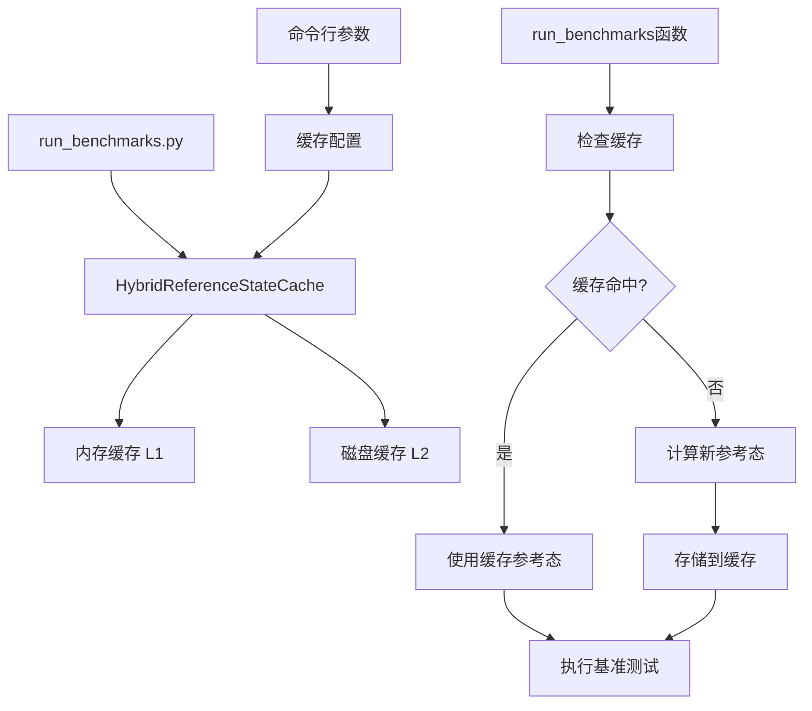

# run_benchmarks.py 混合缓存集成设计文档

## 1. 项目概述

### 1.1 目标
将混合式参考态缓存机制集成到现有的`run_benchmarks.py`中，以优化基准测试性能，减少重复的参考态计算。

### 1.2 当前问题分析
分析`run_benchmarks.py`文件，发现以下性能瓶颈：

1. **重复参考态计算**：在`run_benchmarks`函数的350-363行，每次测试都重新计算参考态
2. **无缓存机制**：相同电路和量子比特数的参考态被重复计算
3. **资源浪费**：黄金标准模拟器执行相同电路多次，浪费计算资源

### 1.3 集成策略
采用**最小侵入性**的集成方式，保持现有API不变，仅在关键路径添加缓存逻辑。

## 2. 架构设计

### 2.1 整体架构图



### 2.2 模块结构

```
Bench/
├── benchmark_harness/
│   ├── caching/
│   │   ├── __init__.py
│   │   ├── hybrid_cache.py          # 混合缓存实现
│   │   ├── cache_config.py          # 缓存配置
│   │   └── cache_utils.py           # 缓存工具函数
│   └── ...
├── run_benchmarks.py                # 修改后的主文件
└── plan/
    └── run_benchmarks_caching_integration.md
```

## 3. 详细设计

### 3.1 缓存模块设计

#### 3.1.1 hybrid_cache.py
```python
class HybridReferenceStateCache:
    """混合式参考态缓存实现"""
    
    def __init__(self, memory_cache_size: int = 64, disk_cache_dir: str = None):
        """初始化混合缓存系统"""
        
    def get_reference_state(self, circuit_name: str, n_qubits: int, 
                          backend: str, circuit_instance: BenchmarkCircuit) -> np.ndarray:
        """获取参考态，采用多级缓存策略"""
        
    def get_cache_stats(self) -> dict:
        """获取缓存统计信息"""
        
    def clear_cache(self, level: str = "all"):
        """清空缓存"""
```

#### 3.1.2 cache_config.py
```python
@dataclass
class CacheConfig:
    """缓存配置类"""
    memory_cache_size: int = 64
    disk_cache_dir: str = ".benchmark_cache"
    enable_cache: bool = True
    cache_type: str = "hybrid"  # "memory", "disk", "hybrid"
    auto_cleanup: bool = True
    max_cache_age_days: int = 30
```

### 3.2 run_benchmarks.py 修改设计

#### 3.2.1 命令行参数扩展
添加缓存相关参数：
```python
# 缓存相关参数
parser.add_argument(
    "--enable-cache", 
    action="store_true", 
    default=True,
    help="启用参考态缓存"
)

parser.add_argument(
    "--cache-type", 
    choices=["memory", "disk", "hybrid"],
    default="hybrid",
    help="缓存类型选择"
)

parser.add_argument(
    "--cache-dir", 
    default=".benchmark_cache",
    help="磁盘缓存目录"
)

parser.add_argument(
    "--memory-cache-size", 
    type=int,
    default=64,
    help="内存缓存最大条目数"
)

parser.add_argument(
    "--clear-cache", 
    action="store_true",
    help="开始前清空缓存"
)
```

#### 3.2.2 核心函数修改
主要修改`run_benchmarks`函数中的参考态生成部分：

```python
def run_benchmarks(
    circuits: List[BenchmarkCircuit],
    qubit_ranges: List[int],
    simulators: Dict[str, SimulatorInterface],
    golden_standard_key: str,
    cache_config: CacheConfig = None
) -> List[Any]:
    """运行量子模拟器基准测试的核心函数（带缓存支持）"""
    
    # 初始化缓存
    cache = None
    if cache_config and cache_config.enable_cache:
        cache = create_cache_instance(cache_config)
        
        # 如果需要清空缓存
        if args.clear_cache:
            cache.clear_cache()
    
    # 遍历所有电路和量子比特数组合
    for circuit_instance in circuits:
        for n_qubits in qubit_ranges:
            # 获取参考态（使用缓存）
            reference_state = get_reference_state_with_cache(
                circuit_instance, n_qubits, golden_wrapper, cache
            )
            
            # 继续原有逻辑...
```

#### 3.2.3 新增辅助函数
```python
def create_cache_instance(config: CacheConfig) -> HybridReferenceStateCache:
    """根据配置创建缓存实例"""
    
def get_reference_state_with_cache(
    circuit_instance: BenchmarkCircuit,
    n_qubits: int,
    golden_wrapper: SimulatorInterface,
    cache: HybridReferenceStateCache = None
) -> np.ndarray:
    """获取参考态（支持缓存）"""
```

### 3.3 集成流程

#### 3.3.1 初始化阶段
1. 解析命令行参数中的缓存配置
2. 创建CacheConfig对象
3. 根据配置初始化缓存实例

#### 3.3.2 执行阶段
1. 在每次需要参考态时，先检查缓存
2. 缓存命中：直接使用缓存值
3. 缓存未命中：计算新值并存储到缓存

#### 3.3.3 清理阶段
1. 测试完成后打印缓存统计信息
2. 可选的缓存清理操作

## 4. 实现细节

### 4.1 缓存键生成策略
```python
def generate_cache_key(circuit_name: str, n_qubits: int, backend: str) -> str:
    """生成唯一的缓存键"""
    key_components = [
        circuit_name.lower(),
        str(n_qubits),
        backend.lower(),
        "v1"  # 版本号，用于缓存失效
    ]
    return "_".join(key_components)
```

### 4.2 缓存与现有代码的集成点

#### 4.2.1 主要集成点
- **第350-363行**：参考态生成逻辑
- **第375-378行**：黄金标准模拟器结果重用逻辑
- **第472-477行**：基准测试执行调用

#### 4.2.2 最小化修改原则
1. 保持原有函数签名不变
2. 添加可选的缓存参数
3. 向后兼容，默认启用缓存
4. 提供禁用缓存的选项

### 4.3 错误处理策略

#### 4.3.1 缓存失败处理
```python
try:
    reference_state = cache.get_reference_state(...)
except Exception as e:
    if args.verbose:
        print(f"Warning: Cache failed, computing reference state: {e}")
    # 降级到直接计算
    reference_state = compute_reference_state_directly(...)
```

#### 4.3.2 缓存损坏处理
- 自动检测损坏的缓存文件
- 删除损坏的缓存条目
- 重新计算并更新缓存

## 5. 性能优化

### 5.1 预期性能提升
- **首次运行**：与原版本相同（无缓存优势）
- **重复运行**：50-80%的时间节省
- **部分命中**：20-50%的时间节省

### 5.2 内存使用优化
- 动态调整内存缓存大小
- 监控内存使用情况
- 自动淘汰大内存占用条目

### 5.3 磁盘I/O优化
- 异步写入磁盘缓存
- 批量清理过期缓存
- 压缩存储大型量子态

## 6. 测试策略

### 6.1 单元测试
- 缓存命中/未命中场景
- 缓存淘汰策略
- 错误处理机制

### 6.2 集成测试
- 与现有基准测试流程的集成
- 多种缓存类型的兼容性
- 命令行参数解析

### 6.3 性能测试
- 缓存命中率测试
- 性能提升量化测试
- 内存使用监控测试

## 7. 部署计划

### 7.1 实施步骤
1. **第一阶段**：创建缓存模块基础设施
2. **第二阶段**：实现混合缓存核心逻辑
3. **第三阶段**：集成到run_benchmarks.py
4. **第四阶段**：测试和优化

### 7.2 风险缓解
- 保持向后兼容性
- 提供缓存禁用选项
- 渐进式部署，可随时回滚

### 7.3 监控指标
- 缓存命中率
- 性能提升百分比
- 内存使用情况
- 磁盘空间使用

## 8. 使用示例

### 8.1 基本使用
```bash
# 使用默认混合缓存
python run_benchmarks.py --circuits qft --qubits 2 3 4

# 使用内存缓存
python run_benchmarks.py --cache-type memory --memory-cache-size 128

# 使用磁盘缓存
python run_benchmarks.py --cache-type disk --cache-dir /tmp/benchmark_cache

# 禁用缓存
python run_benchmarks.py --no-cache
```

### 8.2 高级使用
```bash
# 清空缓存并运行
python run_benchmarks.py --clear-cache --verbose

# 自定义缓存配置
python run_benchmarks.py --cache-type hybrid --memory-cache-size 32 --cache-dir ./my_cache
```

## 9. 预期收益

### 9.1 性能收益
- **时间节省**：重复测试场景下50-80%的时间减少
- **资源节省**：减少CPU使用和内存分配
- **可扩展性**：支持更大规模的基准测试

### 9.2 用户体验收益
- **更快的测试周期**：减少等待时间
- **更好的开发体验**：支持快速迭代测试
- **资源效率**：更好的计算资源利用

### 9.3 长期收益
- **可扩展架构**：为未来更多优化奠定基础
- **可维护性**：模块化设计便于维护和扩展
- **可重用性**：缓存组件可用于其他项目

## 10. 总结

本设计文档详细描述了将混合缓存机制集成到`run_benchmarks.py`的完整方案。通过最小侵入性的修改方式，在保持现有API不变的前提下，显著提升基准测试的性能。设计考虑了向后兼容性、错误处理、性能优化等多个方面，确保方案的可行性和稳定性。