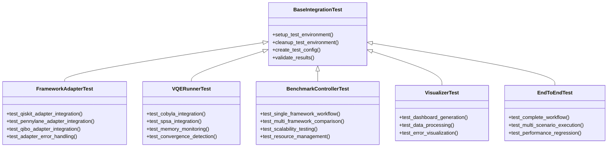

# VQE集成测试实现指南

## 1. 实现概述

本指南提供了VQE基准测试框架集成测试的详细实现方案。基于前面的设计和配置文档，我们将实现一个全面的集成测试套件，验证框架的端到端功能。

## 2. 实现结构

### 2.1 文件组织结构

```
Bench/
├── tests/
│   ├── __init__.py
│   ├── conftest.py                    # pytest配置和fixtures
│   ├── test_framework_adapters.py     # 框架适配器集成测试
│   ├── test_vqe_runner.py            # VQE执行引擎集成测试
│   ├── test_benchmark_controller.py   # 基准测试控制器集成测试
│   ├── test_visualizer.py            # 可视化组件集成测试
│   ├── test_end_to_end.py            # 端到端工作流测试
│   ├── test_error_handling.py        # 错误处理和边界条件测试
│   └── test_integration_suite.py     # 完整集成测试套件
├── test_configs/
│   ├── __init__.py
│   ├── quick_test_config.py          # 快速测试配置
│   ├── standard_test_config.py       # 标准测试配置
│   ├── stress_test_config.py         # 压力测试配置
│   └── error_test_config.py          # 错误场景配置
├── test_data/
│   ├── __init__.py
│   ├── mock_results.py               # 模拟测试结果
│   ├── reference_values.py           # 参考值和预期结果
│   └── test_hamiltonians.py          # 测试用哈密顿量数据
├── test_utils/
│   ├── __init__.py
│   ├── test_helpers.py               # 测试辅助函数
│   ├── assertions.py                 # 自定义断言
│   └── fixtures.py                   # 测试fixtures
└── test_reports/
    ├── templates/                    # 测试报告模板
    └── output/                       # 测试报告输出
```

### 2.2 测试类层次结构



## 3. 实现优先级

### 3.1 第一阶段：核心组件集成测试

1. **框架适配器集成测试**
   - 测试各框架适配器的完整工作流
   - 验证哈密顿量构建、Ansatz创建和成本函数生成
   - 测试参数数量计算和错误处理

2. **VQE执行引擎集成测试**
   - 测试不同优化器的集成
   - 验证性能监控功能
   - 测试收敛检测机制

### 3.2 第二阶段：工作流集成测试

1. **基准测试控制器集成测试**
   - 测试单框架和多框架工作流
   - 验证结果收集和统计计算
   - 测试资源管理和限制

2. **可视化组件集成测试**
   - 测试仪表盘生成功能
   - 验证数据处理和异常处理
   - 测试文件保存和输出

### 3.3 第三阶段：端到端测试

1. **完整工作流测试**
   - 测试从配置到可视化的完整流程
   - 验证多场景执行能力
   - 测试性能回归检测

2. **错误处理和边界条件测试**
   - 测试各种错误场景
   - 验证错误恢复机制
   - 测试资源耗尽处理

## 4. 关键实现细节

### 4.1 测试隔离和环境管理

```python
# conftest.py

import pytest
import tempfile
import shutil
from typing import Dict, Any

@pytest.fixture(scope="session")
def test_environment():
    """创建会话级别的测试环境"""
    temp_dir = tempfile.mkdtemp(prefix="vqe_test_session_")
    yield temp_dir
    shutil.rmtree(temp_dir)

@pytest.fixture(scope="function")
def test_output_dir(test_environment):
    """创建函数级别的测试输出目录"""
    output_dir = tempfile.mkdtemp(prefix="vqe_test_output_", dir=test_environment)
    yield output_dir
    shutil.rmtree(output_dir)

@pytest.fixture
def quick_test_config():
    """提供快速测试配置"""
    from test_configs.quick_test_config import QUICK_TEST_CONFIG
    return QUICK_TEST_CONFIG.copy()

@pytest.fixture
def standard_test_config():
    """提供标准测试配置"""
    from test_configs.standard_test_config import STANDARD_TEST_CONFIG
    return STANDARD_TEST_CONFIG.copy()
```

### 4.2 模拟数据和依赖管理

```python
# test_utils/fixtures.py

import pytest
from unittest.mock import Mock, patch
from test_data.mock_results import MOCK_RESULTS

@pytest.fixture
def mock_qiskit_available():
    """模拟Qiskit可用"""
    with patch('vqe_bench_new.QISKIT_AVAILABLE', True):
        yield

@pytest.fixture
def mock_pennylane_available():
    """模拟PennyLane可用"""
    with patch('vqe_bench_new.PENNYLANE_AVAILABLE', True):
        yield

@pytest.fixture
def mock_qibo_available():
    """模拟Qibo可用"""
    with patch('vqe_bench_new.QIBO_AVAILABLE', True):
        yield

@pytest.fixture
def mock_framework_results():
    """提供模拟框架测试结果"""
    return MOCK_RESULTS

@pytest.fixture
def mock_memory_monitor():
    """模拟内存监控器"""
    monitor = Mock()
    monitor.get_peak_mb.return_value = 100.0
    monitor.is_memory_exceeded.return_value = False
    return monitor
```

### 4.3 自定义断言和验证

```python
# test_utils/assertions.py

def assert_valid_hamiltonian(hamiltonian, framework, n_qubits):
    """断言哈密顿量有效"""
    assert hamiltonian is not None, f"{framework} hamiltonian should not be None"
    
    if framework == "Qiskit":
        assert hasattr(hamiltonian, 'paulis'), "Qiskit hamiltonian should have paulis attribute"
        assert len(hamiltonian.paulis) > 0, "Qiskit hamiltonian should have pauli terms"
    elif framework == "PennyLane":
        assert hasattr(hamiltonian, 'coeffs'), "PennyLane hamiltonian should have coeffs attribute"
        assert hasattr(hamiltonian, 'ops'), "PennyLane hamiltonian should have ops attribute"
    elif framework == "Qibo":
        assert hasattr(hamiltonian, 'terms'), "Qibo hamiltonian should have terms attribute"

def assert_valid_ansatz(ansatz, framework, n_qubits):
    """断言Ansatz有效"""
    assert ansatz is not None, f"{framework} ansatz should not be None"
    
    if framework == "Qiskit":
        assert hasattr(ansatz, 'num_parameters'), "Qiskit ansatz should have num_parameters"
        assert hasattr(ansatz, 'num_qubits'), "Qiskit ansatz should have num_qubits"
        assert ansatz.num_qubits == n_qubits, f"Qiskit ansatz should have {n_qubits} qubits"
    elif framework == "PennyLane":
        assert callable(ansatz), "PennyLane ansatz should be callable"
    elif framework == "Qibo":
        assert hasattr(ansatz, 'nqubits'), "Qibo ansatz should have nqubits attribute"
        assert ansatz.nqubits == n_qubits, f"Qibo ansatz should have {n_qubits} qubits"

def assert_valid_cost_function(cost_function):
    """断言成本函数有效"""
    assert callable(cost_function), "Cost function should be callable"
    
    # 测试成本函数调用
    import numpy as np
    test_params = np.random.rand(4)  # 小规模测试参数
    
    try:
        energy = cost_function(test_params)
        assert isinstance(energy, (int, float)), "Cost function should return numeric value"
        assert not np.isnan(energy), "Cost function should not return NaN"
        assert not np.isinf(energy), "Cost function should not return Inf"
    except Exception as e:
        pytest.fail(f"Cost function call failed: {e}")
```

## 5. 测试执行策略

### 5.1 测试分层执行

```bash
# 第一阶段：核心组件测试
pytest tests/test_framework_adapters.py -v
pytest tests/test_vqe_runner.py -v

# 第二阶段：工作流测试
pytest tests/test_benchmark_controller.py -v
pytest tests/test_visualizer.py -v

# 第三阶段：端到端测试
pytest tests/test_end_to_end.py -v
pytest tests/test_error_handling.py -v

# 完整测试套件
pytest tests/test_integration_suite.py -v
```

### 5.2 并行测试执行

```bash
# 使用pytest-xdist并行执行
pytest tests/ -n auto -v

# 按测试类型并行执行
pytest tests/test_framework_adapters.py tests/test_vqe_runner.py -n auto -v
pytest tests/test_benchmark_controller.py tests/test_visualizer.py -n auto -v
```

### 5.3 测试标记和过滤

```python
# 测试标记示例
@pytest.mark.integration
def test_framework_integration():
    pass

@pytest.mark.slow
def test_large_scale_integration():
    pass

@pytest.mark.quick
def test_basic_integration():
    pass
```

```bash
# 按标记执行测试
pytest tests/ -m "not slow" -v  # 跳过慢速测试
pytest tests/ -m "quick" -v     # 只执行快速测试
pytest tests/ -m "integration" -v  # 只执行集成测试
```

## 6. 性能测试和基准

### 6.1 性能基准测试

```python
# test_performance.py

import time
import pytest
from test_utils.test_helpers import check_resource_usage
from test_data.reference_values import PERFORMANCE_BENCHMARKS

@pytest.mark.performance
def test_performance_benchmarks(standard_test_config):
    """测试性能基准"""
    from vqe_bench_new import BenchmarkController
    
    controller = BenchmarkController(standard_test_config)
    results = controller.run_all_benchmarks()
    
    violations = check_resource_usage(results, PERFORMANCE_BENCHMARKS)
    assert len(violations) == 0, f"Performance violations: {violations}"

@pytest.mark.parametrize("n_qubits", [4, 6, 8])
@pytest.mark.performance
def test_scalability_performance(n_qubits):
    """测试可扩展性性能"""
    # 测试不同规模下的性能表现
    pass
```

### 6.2 回归测试

```python
# test_regression.py

def test_regression_fixed_issues():
    """测试已修复问题的回归"""
    # 测试之前发现并修复的问题
    pass

def test_performance_regression():
    """测试性能回归"""
    # 确保新版本不会引入性能退化
    pass
```

## 7. 持续集成配置

### 7.1 GitHub Actions配置

```yaml
# .github/workflows/integration_tests.yml
name: VQE Integration Tests

on:
  push:
    branches: [ main, develop ]
  pull_request:
    branches: [ main ]

jobs:
  quick-tests:
    runs-on: ubuntu-latest
    steps:
    - uses: actions/checkout@v2
    - name: Set up Python
      uses: actions/setup-python@v2
      with:
        python-version: 3.9
    - name: Install dependencies
      run: |
        pip install -r requirements.txt
        pip install pytest pytest-cov
    - name: Run quick tests
      run: |
        pytest tests/ -m "quick" --cov=vqe_bench_new --cov-report=xml

  integration-tests:
    runs-on: ubuntu-latest
    needs: quick-tests
    if: github.event_name == 'push'
    steps:
    - uses: actions/checkout@v2
    - name: Set up Python
      uses: actions/setup-python@v2
      with:
        python-version: 3.9
    - name: Install dependencies
      run: |
        pip install -r requirements.txt
        pip install pytest pytest-cov pytest-xdist
    - name: Run integration tests
      run: |
        pytest tests/ -n auto --cov=vqe_bench_new --cov-report=xml
    - name: Upload coverage
      uses: codecov/codecov-action@v1
```

### 7.2 本地开发工作流

```bash
# 开发前快速检查
make quick-test

# 提交前完整测试
make full-test

# 性能测试
make performance-test

# 生成测试报告
make test-report
```

## 8. 测试报告和文档

### 8.1 测试报告生成

```python
# test_utils/reporting.py

import json
import datetime
from typing import Dict, Any

def generate_test_report(test_results: Dict[str, Any], output_dir: str):
    """生成测试报告"""
    report = {
        "timestamp": datetime.datetime.now().isoformat(),
        "summary": {
            "total_tests": len(test_results),
            "passed": sum(1 for r in test_results.values() if r["status"] == "passed"),
            "failed": sum(1 for r in test_results.values() if r["status"] == "failed"),
            "skipped": sum(1 for r in test_results.values() if r["status"] == "skipped"),
        },
        "details": test_results
    }
    
    report_file = os.path.join(output_dir, f"test_report_{datetime.datetime.now().strftime('%Y%m%d_%H%M%S')}.json")
    with open(report_file, 'w') as f:
        json.dump(report, f, indent=2)
    
    return report_file
```

### 8.2 测试文档生成

```python
# test_utils/documentation.py

def generate_test_documentation(test_cases, output_dir):
    """生成测试文档"""
    # 生成Markdown格式的测试文档
    pass
```

## 9. 维护和更新策略

### 9.1 测试维护指南

1. **定期更新测试配置**
   - 根据框架更新调整测试配置
   - 更新参考值和性能基准
   - 添加新的测试场景

2. **测试代码质量**
   - 保持测试代码清晰和可维护
   - 定期重构测试代码
   - 添加适当的注释和文档

3. **测试数据管理**
   - 定期更新模拟数据
   - 验证参考值的准确性
   - 清理过时的测试数据

### 9.2 测试扩展指南

1. **添加新框架测试**
   - 实现新的框架适配器测试
   - 添加框架特定的测试用例
   - 更新配置和模拟数据

2. **添加新算法测试**
   - 实现新算法的集成测试
   - 更新优化器配置
   - 添加性能基准

3. **扩展测试场景**
   - 设计新的测试场景
   - 添加边界条件测试
   - 增强错误处理测试

## 10. 总结

本实现指南提供了VQE基准测试框架集成测试的全面实现方案。通过分层测试、模块化设计和自动化执行，我们可以确保框架的可靠性和性能。

关键成功因素：
1. **全面的测试覆盖**：涵盖所有关键组件和工作流
2. **可靠的测试环境**：使用模拟和隔离技术
3. **自动化执行**：集成到CI/CD流程中
4. **持续维护**：定期更新和优化测试

通过遵循本指南，我们可以构建一个强大、可靠的集成测试套件，确保VQE基准测试框架的质量和稳定性。