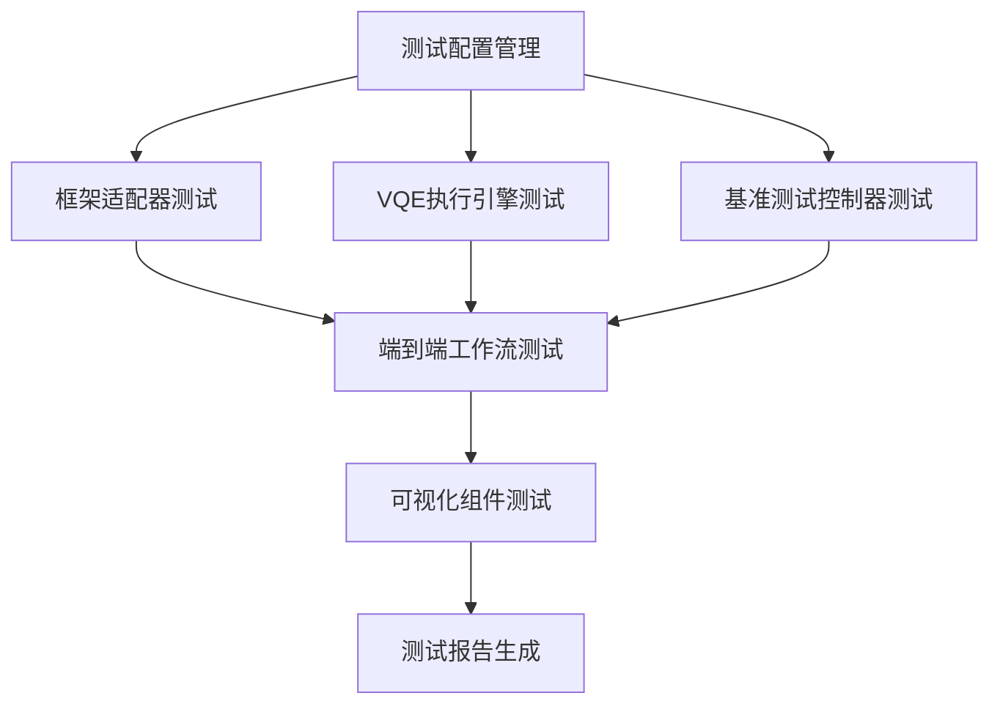

# VQE基准测试框架集成测试设计

## 1. 测试目标

本集成测试套件旨在验证VQE基准测试框架的端到端功能，确保各个组件能够正确协作，完成从配置到结果可视化的整个工作流程。

## 2. 测试架构

### 2.1 测试组件关系图



### 2.2 测试层次结构

1. **组件级集成测试**
   - 框架适配器与VQE执行引擎集成
   - VQE执行引擎与性能监控集成
   - 基准测试控制器与各组件集成

2. **工作流集成测试**
   - 单框架完整工作流测试
   - 多框架对比测试工作流
   - 不同配置下的工作流测试

3. **系统级集成测试**
   - 端到端完整流程测试
   - 错误处理和恢复测试
   - 资源限制和边界条件测试

## 3. 测试用例设计

### 3.1 框架适配器集成测试

#### 测试用例 FA-IT-001: Qiskit适配器完整工作流
**目标**: 验证Qiskit适配器能够完成从哈密顿量构建到成本函数生成的完整流程

**测试步骤**:
1. 创建Qiskit适配器实例
2. 构建TFIM哈密顿量
3. 构建HardwareEfficient Ansatz
4. 生成成本函数
5. 验证成本函数可调用性
6. 测试参数数量计算

**预期结果**:
- 所有步骤成功执行
- 成本函数返回有效能量值
- 参数数量与Ansatz结构匹配

#### 测试用例 FA-IT-002: PennyLane适配器完整工作流
**目标**: 验证PennyLane适配器能够完成从哈密顿量构建到成本函数生成的完整流程

**测试步骤**:
1. 创建PennyLane适配器实例
2. 构建TFIM哈密顿量
3. 构建HardwareEfficient Ansatz
4. 生成成本函数
5. 验证成本函数可调用性
6. 测试参数数量计算

**预期结果**:
- 所有步骤成功执行
- 成本函数返回有效能量值
- 参数数量与Ansatz结构匹配

#### 测试用例 FA-IT-003: Qibo适配器完整工作流
**目标**: 验证Qibo适配器能够完成从哈密顿量构建到成本函数生成的完整流程

**测试步骤**:
1. 创建Qibo适配器实例
2. 构建TFIM哈密顿量
3. 构建HardwareEfficient Ansatz
4. 生成成本函数
5. 验证成本函数可调用性
6. 测试参数数量计算

**预期结果**:
- 所有步骤成功执行
- 成本函数返回有效能量值
- 参数数量与Ansatz结构匹配

### 3.2 VQE执行引擎集成测试

#### 测试用例 VQE-IT-001: COBYLA优化器集成测试
**目标**: 验证VQE执行引擎与COBYLA优化器的集成

**测试步骤**:
1. 创建简单的二次成本函数
2. 配置COBYLA优化器
3. 创建VQE执行引擎
4. 执行优化过程
5. 验证收敛历史记录
6. 检查性能指标收集

**预期结果**:
- 优化过程正常执行
- 收敛历史记录完整
- 性能指标正确收集

#### 测试用例 VQE-IT-002: SPSA优化器集成测试
**目标**: 验证VQE执行引擎与SPSA优化器的集成

**测试步骤**:
1. 创建简单的二次成本函数
2. 配置SPSA优化器
3. 创建VQE执行引擎
4. 执行优化过程
5. 验证收敛历史记录
6. 检查性能指标收集

**预期结果**:
- 优化过程正常执行
- 收敛历史记录完整
- 性能指标正确收集

#### 测试用例 VQE-IT-003: memory监控集成测试
**目标**: 验证内存监控与VQE执行引擎的集成

**测试步骤**:
1. 创建VQE执行引擎
2. 启动内存监控
3. 执行资源密集型任务
4. 验证内存峰值记录
5. 检查内存超限处理

**预期结果**:
- 内存监控正常工作
- 峰值内存正确记录
- 内存超限时正确报警

### 3.3 基准测试控制器集成测试

#### 测试用例 BC-IT-001: 单框架基准测试流程
**目标**: 验证基准测试控制器能够完成单框架的完整基准测试流程

**测试步骤**:
1. 创建单框架配置
2. 初始化基准测试控制器
3. 运行基准测试
4. 验证结果收集
5. 检查统计计算

**预期结果**:
- 基准测试正常执行
- 结果正确收集和统计
- 错误正确处理

#### 测试用例 BC-IT-002: 多框架对比测试流程
**目标**: 验证基准测试控制器能够完成多框架的对比测试

**测试步骤**:
1. 创建多框架配置
2. 初始化基准测试控制器
3. 运行基准测试
4. 验证各框架结果收集
5. 检查对比统计

**预期结果**:
- 各框架测试正常执行
- 结果正确收集和对比
- 错误正确处理

#### 测试用例 BC-IT-003: 多规模扩展性测试流程
**目标**: 验证基准测试控制器能够处理多规模问题的测试

**测试步骤**:
1. 创建多规模配置
2. 初始化基准测试控制器
3. 运行基准测试
4. 验证各规模结果收集
5. 检查扩展性统计

**预期结果**:
- 各规模测试正常执行
- 结果正确收集和统计
- 扩展性分析正确

### 3.4 可视化组件集成测试

#### 测试用例 VIS-IT-001: 仪表盘生成测试
**目标**: 验证可视化组件能够正确生成完整的性能仪表盘

**测试步骤**:
1. 创建模拟测试结果
2. 初始化可视化组件
3. 生成仪表盘
4. 验证图表生成
5. 检查文件保存

**预期结果**:
- 仪表盘正确生成
- 所有图表正确显示
- 文件正确保存

#### 测试用例 VIS-IT-002: 数据处理测试
**目标**: 验证可视化组件能够正确处理各种测试结果数据

**测试步骤**:
1. 创建边界条件测试结果
2. 初始化可视化组件
3. 处理测试数据
4. 验证异常数据处理
5. 检查图表显示

**预期结果**:
- 数据正确处理
- 异常数据正确处理
- 图表正确显示

### 3.5 端到端工作流测试

#### 测试用例 E2E-IT-001: 完整工作流测试
**目标**: 验证从配置到可视化的完整工作流程

**测试步骤**:
1. 创建测试配置
2. 初始化基准测试控制器
3. 运行完整基准测试
4. 生成可视化结果
5. 验证端到端结果

**预期结果**:
- 完整工作流正常执行
- 各阶段结果正确
- 最终输出符合预期

#### 测试用例 E2E-IT-002: 错误处理工作流测试
**目标**: 验证工作流中的错误处理机制

**测试步骤**:
1. 创建包含错误的配置
2. 初始化基准测试控制器
3. 运行基准测试
4. 验证错误处理
5. 检查恢复机制

**预期结果**:
- 错误正确识别和处理
- 系统能够恢复或优雅失败
- 错误信息正确记录

## 4. 测试数据和配置

### 4.1 测试配置

#### 快速测试配置
```python
QUICK_TEST_CONFIG = {
    "n_qubits_range": [4],
    "frameworks_to_test": ["Qiskit"],
    "ansatz_type": "HardwareEfficient",
    "optimizer": "COBYLA",
    "n_runs": 1,
    "problem": {
        "j_coupling": 1.0,
        "h_field": 1.0
    },
    "ansatz_details": {
        "n_layers": 1,
        "entanglement_style": "linear"
    },
    "optimizer_details": {
        "max_evaluations": 10,
        "accuracy_threshold": 1e-3
    }
}
```

#### 标准测试配置
```python
STANDARD_TEST_CONFIG = {
    "n_qubits_range": [4, 6],
    "frameworks_to_test": ["Qiskit", "PennyLane"],
    "ansatz_type": "HardwareEfficient",
    "optimizer": "COBYLA",
    "n_runs": 2,
    "problem": {
        "j_coupling": 1.0,
        "h_field": 1.0
    },
    "ansatz_details": {
        "n_layers": 2,
        "entanglement_style": "linear"
    },
    "optimizer_details": {
        "max_evaluations": 50,
        "accuracy_threshold": 1e-4
    }
}
```

### 4.2 模拟数据

#### 框架测试结果
```python
MOCK_FRAMEWORK_RESULTS = {
    "Qiskit": {
        4: {
            "avg_time_to_solution": 1.23,
            "std_time_to_solution": 0.45,
            "avg_total_time": 2.34,
            "std_total_time": 0.56,
            "avg_peak_memory": 123.45,
            "std_peak_memory": 12.34,
            "avg_total_evals": 123,
            "std_total_evals": 23,
            "avg_final_error": 1e-4,
            "std_final_error": 5e-5,
            "avg_quantum_time": 0.012,
            "std_quantum_time": 0.003,
            "avg_classic_time": 0.023,
            "std_classic_time": 0.005,
            "convergence_rate": 0.9,
            "energy_histories": [[1.0, 0.8, 0.6, 0.5, 0.4]],
            "errors": []
        }
    }
}
```

## 5. 测试实现策略

### 5.1 测试框架选择

使用Python标准库中的`unittest`框架作为基础，结合`pytest`的参数化测试功能，实现灵活的测试用例管理。

### 5.2 测试隔离

每个测试用例都应该在独立的环境中执行，确保测试之间不会相互影响。使用临时目录和独立的配置实例。

### 5.3 测试数据管理

使用fixture模式管理测试数据，确保测试数据的一致性和可重复性。

### 5.4 测试报告

生成详细的测试报告，包括：
- 测试执行统计
- 失败测试详情
- 性能指标
- 覆盖率分析

## 6. 测试执行计划

### 6.1 测试阶段

1. **组件集成测试阶段**: 验证各组件之间的集成
2. **工作流集成测试阶段**: 验证完整工作流程
3. **系统集成测试阶段**: 验证端到端功能
4. **回归测试阶段**: 确保新更改不破坏现有功能

### 6.2 测试环境

1. **开发环境**: 日常开发中的快速验证
2. **集成环境**: 完整功能的集成测试
3. **生产环境**: 最终发布前的验证

### 6.3 测试自动化

1. **持续集成**: 在代码提交时自动运行测试
2. **定时测试**: 定期运行完整测试套件
3. **触发测试**: 在特定条件下运行测试

## 7. 测试验收标准

### 7.1 功能验收标准

- 所有关键功能正常工作
- 错误处理机制有效
- 性能指标符合预期

### 7.2 质量验收标准

- 代码覆盖率 > 80%
- 所有测试用例通过
- 无严重性能问题

### 7.3 文档验收标准

- 测试文档完整
- 测试用例清晰
- 测试结果可追溯

## 8. 风险和缓解措施

### 8.1 测试风险

1. **依赖风险**: 外部依赖可能不可用
2. **资源风险**: 测试可能消耗大量资源
3. **时间风险**: 测试执行时间可能过长

### 8.2 缓解措施

1. **模拟依赖**: 使用模拟对象替代外部依赖
2. **资源限制**: 设置合理的资源限制
3. **并行测试**: 并行执行测试以节省时间

## 9. 测试维护

### 9.1 测试更新

- 随功能更新同步更新测试
- 定期审查和优化测试用例
- 移除过时的测试用例

### 9.2 测试优化

- 优化测试执行时间
- 提高测试稳定性
- 增强测试可读性