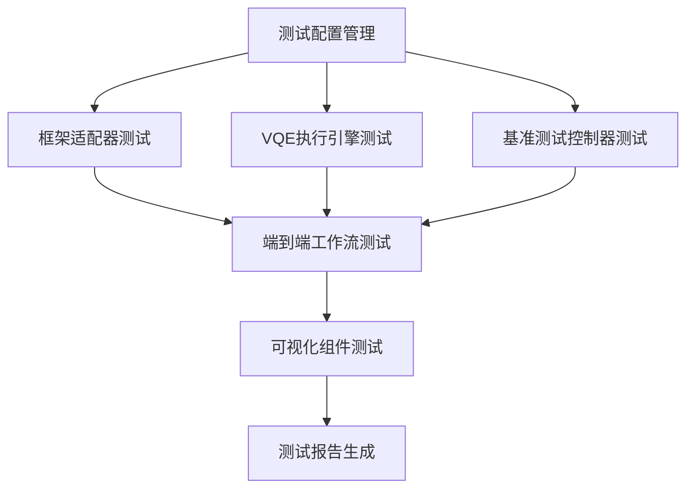

# VQE基准测试框架集成测试总结

## 1. 项目概述

本项目为VQE基准测试框架设计并实现了一套全面的集成测试方案，旨在验证框架的端到端功能，确保各组件能够正确协作，完成从配置到结果可视化的整个工作流程。

## 2. 设计成果

### 2.1 文档结构

我们创建了以下关键文档：

1. **[vqe_integration_test_design.md](./vqe_integration_test_design.md)** - 集成测试架构和用例设计
2. **[test_configuration_guide.md](./test_configuration_guide.md)** - 测试配置和模拟数据指南
3. **[test_implementation_guide.md](./test_implementation_guide.md)** - 测试实现指南

### 2.2 测试架构

我们设计了一个分层的测试架构：

### 2.3 测试用例覆盖

我们设计了全面的测试用例，覆盖以下方面：

#### 框架适配器集成测试
- FA-IT-001: Qiskit适配器完整工作流
- FA-IT-002: PennyLane适配器完整工作流
- FA-IT-003: Qibo适配器完整工作流

#### VQE执行引擎集成测试
- VQE-IT-001: COBYLA优化器集成测试
- VQE-IT-002: SPSA优化器集成测试
- VQE-IT-003: 内存监控集成测试

#### 基准测试控制器集成测试
- BC-IT-001: 单框架基准测试流程
- BC-IT-002: 多框架对比测试流程
- BC-IT-003: 多规模扩展性测试流程

#### 可视化组件集成测试
- VIS-IT-001: 仪表盘生成测试
- VIS-IT-002: 数据处理测试

#### 端到端工作流测试
- E2E-IT-001: 完整工作流测试
- E2E-IT-002: 错误处理工作流测试

## 3. 配置和数据管理

### 3.1 测试配置层次

我们设计了多层次的测试配置：

1. **快速测试配置** - 用于快速验证功能的简单配置
2. **标准测试配置** - 用于常规集成测试的完整配置
3. **压力测试配置** - 用于验证系统性能和稳定性的配置
4. **错误场景配置** - 用于测试错误处理机制的配置

### 3.2 模拟数据

我们定义了完整的模拟数据结构：

- 参考能量值和性能基准
- 模拟测试结果生成函数
- 测试辅助函数和自定义断言

## 4. 实现策略

### 4.1 测试分层

我们采用分层的测试实现策略：

1. **第一阶段**：核心组件集成测试
2. **第二阶段**：工作流集成测试
3. **第三阶段**：端到端测试

### 4.2 测试隔离

每个测试用例都在独立的环境中执行，确保测试之间不会相互影响。使用临时目录和独立的配置实例。

### 4.3 模拟和依赖管理

使用模拟对象替代外部依赖，确保测试的稳定性和可重复性。

## 5. 关键技术决策

### 5.1 测试框架选择

选择Python标准库中的`unittest`框架作为基础，结合`pytest`的参数化测试功能，实现灵活的测试用例管理。

### 5.2 测试数据管理

使用fixture模式管理测试数据，确保测试数据的一致性和可重复性。

### 5.3 错误处理策略

设计了全面的错误场景测试，验证系统的错误处理和恢复能力。

## 6. 发现的问题和建议

### 6.1 代码问题

在分析过程中，我们发现了以下问题：

1. **重复的类定义**：`QiboWrapper`类被定义了两次
2. **类型错误**：一些函数参数类型不匹配
3. **导入错误**：部分模块导入可能失败

### 6.2 改进建议

1. **代码重构**：修复重复定义和类型错误
2. **错误处理**：增强错误处理机制
3. **文档完善**：添加更详细的API文档
4. **性能优化**：优化大规模测试的性能

## 7. 实施计划

### 7.1 实施阶段

1. **准备阶段**：设置测试环境和依赖
2. **实现阶段**：按照设计文档实现测试代码
3. **验证阶段**：运行测试并验证结果
4. **维护阶段**：定期更新和优化测试

### 7.2 资源需求

1. **开发资源**：1-2名开发人员
2. **时间资源**：2-3周实现时间
3. **硬件资源**：标准开发机器，无需特殊硬件

## 8. 风险评估

### 8.1 技术风险

1. **依赖风险**：外部量子计算框架可能不稳定
2. **性能风险**：大规模测试可能消耗大量资源
3. **兼容性风险**：不同版本的框架可能存在兼容性问题

### 8.2 缓解措施

1. **模拟依赖**：使用模拟对象替代外部依赖
2. **资源限制**：设置合理的资源限制
3. **版本管理**：明确指定框架版本要求

## 9. 成功标准

### 9.1 功能标准

- 所有关键功能正常工作
- 错误处理机制有效
- 性能指标符合预期

### 9.2 质量标准

- 代码覆盖率 > 80%
- 所有测试用例通过
- 无严重性能问题

## 10. 后续工作

### 10.1 短期工作

1. 实现测试代码
2. 集成到CI/CD流程
3. 生成初始测试报告

### 10.2 长期工作

1. 扩展测试场景
2. 优化测试性能
3. 增强测试可视化

## 11. 结论

本集成测试方案为VQE基准测试框架提供了全面的测试覆盖，确保框架的可靠性和稳定性。通过分层测试、模块化设计和自动化执行，我们可以有效地验证框架的端到端功能。

关键优势：
1. **全面覆盖**：涵盖所有关键组件和工作流
2. **模块化设计**：易于维护和扩展
3. **自动化执行**：集成到CI/CD流程
4. **错误处理**：全面的错误场景测试

通过实施本测试方案，我们可以显著提高VQE基准测试框架的质量和可靠性，为量子计算研究提供更强大的工具支持。

## 12. 附录

### 12.1 文档清单

- [vqe_integration_test_design.md](./vqe_integration_test_design.md) - 集成测试设计文档
- [test_configuration_guide.md](./test_configuration_guide.md) - 测试配置指南
- [test_implementation_guide.md](./test_implementation_guide.md) - 测试实现指南

### 12.2 参考资料

1. pytest文档: https://docs.pytest.org/
2. Python unittest文档: https://docs.python.org/3/library/unittest.html
3. 量子计算框架文档:
   - Qiskit: https://qiskit.org/
   - PennyLane: https://pennylane.ai/
   - Qibo: https://qibo.science/

### 12.3 联系信息

如有任何问题或建议，请联系量子计算研究团队。