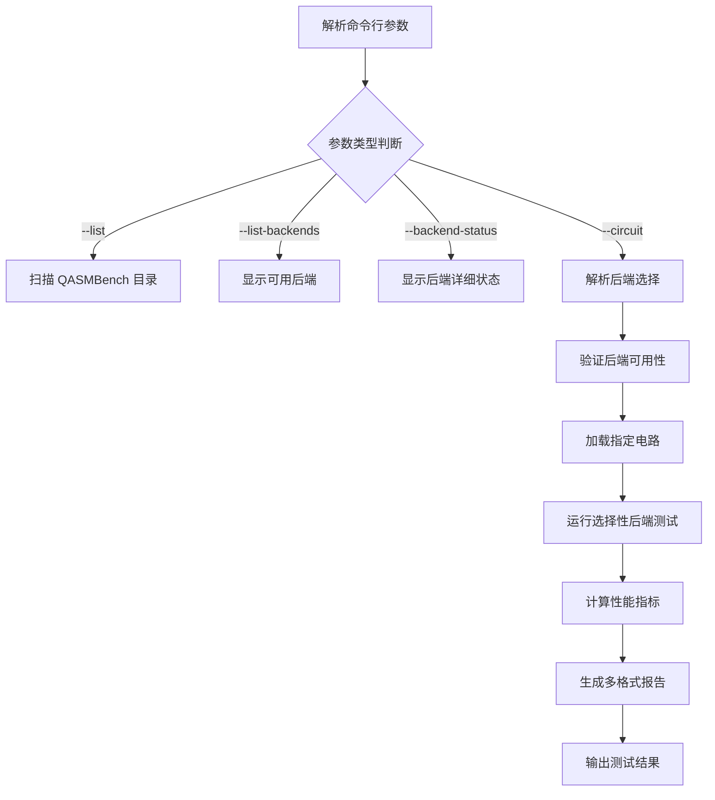

# qasmbench_runner.py 技术文档 (v2.0 - 后端选择版本)

## 概述

**脚本名称：** qasmbench_runner.py

**一句话简介：** 一个增强版的 QASMBench 量子电路基准测试工具，支持选择性后端测试、后端状态管理和灵活的配置选项，专为高性能量子计算后端比较而设计。

**核心功能列表详解：**

| 参数 | 简写 | 类型 | 必填 | 默认值 | 说明 |
|------|------|------|------|--------|------|
| `--list` | 无 | bool | 否 | False | 列出所有可用的 QASMBench 电路 |
| `--list-backends` | 无 | bool | 否 | False | 列出所有可用的 Qibo 后端 |
| `--backend-status` | 无 | bool | 否 | False | 显示所有后端的详细状态和依赖信息 |
| `--circuit` | 无 | String | 否 | 无 | 指定 QASM 电路文件的完整路径进行基准测试 |
| `--backends` | 无 | String | 否 | None | 指定要测试的后端，用逗号分隔 |

### 内置配置参数

| 配置项 | 默认值 | 说明 |
|--------|--------|------|
| `num_runs` | 5 | 每个后端正式运行的次数 |
| `warmup_runs` | 1 | 预热运行次数，用于 JIT 编译 |
| `output_formats` | ['csv', 'markdown', 'json'] | 支持的报告输出格式 |
| `baseline_backend` | "numpy" | 性能比较的基准后端 |
| `qasm_directory` | "../QASMBench" | QASMBench 电路根目录 |

### 支持的后端

| 后端名称 | 平台 | 描述 | 依赖 | 优先级 |
|----------|------|------|------|--------|
| numpy | - | NumPy后端（默认基准） | numpy | 0 |
| qibojit(numba) | numba | QiboJIT with Numba编译器 | numba | 1 |
| qibotn(qutensornet) | qutensornet | QiboTensorNetwork with Qutensornet | Quimb | 2 |
| qiboml(jax) | jax | QiboML with JAX | jax | 3 |
| qiboml(pytorch) | pytorch | QiboML with PyTorch | torch | 4 |
| qiboml(tensorflow) | tensorflow | QiboML with TensorFlow | tensorflow | 5 |
| qulacs | - | Qulacs后端 | qulacs | 6 |

### 性能指标

| 指标名称 | 单位 | 说明 |
|----------|------|------|
| 执行时间均值 | 秒 | 多次运行的平均执行时间 |
| 执行时间标准差 | 秒 | 执行时间的统计标准差 |
| 峰值内存占用 | MB | 运行过程中的最大内存使用量 |
| 加速比 | 倍数 | 相对于基准后端的性能提升倍数 |
| 吞吐率 | 门/秒 | 每秒处理的量子门数量 |
| JIT 编译时间 | 秒 | 首次运行的编译时间 |
| 电路构建时间 | 秒 | 从 QASM 文件构建电路的时间 |
| 保真度 | 无 | 与基准结果的相似度（0-1） |

**使用示例：**

- **示例1：列出所有可用后端**
  ```bash
  python qasmbench_runner.py --list-backends
  ```
  *说明：此命令会显示所有可用的 Qibo 后端及其状态，包括依赖关系和可用性。*

- **示例2：测试指定电路的所有后端**
  ```bash
  python qasmbench_runner.py --circuit ../QASMBench/medium/qft_n18/qft_n18_transpiled.qasm
  ```
  *说明：此命令会在所有可用的后端上测试指定的 QASM 电路，并生成性能比较报告。*

- **示例3：选择性后端测试**
  ```bash
  python qasmbench_runner.py --circuit ../QASMBench/medium/qft_n18/qft_n18_transpiled.qasm --backends "numpy,qibojit(numba)"
  ```
  *说明：此命令仅在指定的后端上运行基准测试，适合针对特定后端进行性能分析。*

- **示例4：查看后端详细状态**
  ```bash
  python qasmbench_runner.py --backend-status
  ```
  *说明：此命令会显示所有后端的详细状态信息，包括依赖检查和可用性验证。*

## 核心逻辑与架构

### 工作流程



### 架构设计

#### 1. 后端管理层
- `BackendConfig` 类：后端配置信息管理
- `BackendRegistry` 类：后端注册和发现机制
- 全局后端注册器：统一管理所有可用后端

#### 2. 配置管理层 (`QASMBenchConfig`)
- 管理测试参数配置
- 定义默认测试环境
- 支持运行时参数调整

#### 3. 指标收集层 (`QASMBenchMetrics`)
- 存储和量化性能指标
- 支持多种性能数据类型
- 提供统一的指标接口

#### 4. 报告生成层 (`QASMBenchReporter`)
- 多格式报告生成（CSV、Markdown、JSON）
- 电路图可视化保存
- 环境信息记录

#### 5. 测试执行层 (`QASMBenchRunner`)
- QASM 电路加载和处理
- 选择性后端基准测试执行
- 正确性验证和性能比较

### 关键算法流程

#### 后端发现和验证算法
1. 注册所有已知后端配置
2. 验证每个后端的依赖可用性
3. 根据用户选择过滤后端列表
4. 确保基准后端存在用于性能比较

#### 选择性测试算法
1. 解析用户指定的后端列表
2. 验证每个后端的可用性
3. 确定测试顺序（基准后端优先）
4. 执行选择的后端基准测试

#### 性能比较算法
1. 收集所有测试后端的性能数据
2. 以基准后端为基准计算加速比
3. 生成性能排名和分析报告
4. 识别最优和最差性能后端

## 核心类和函数详解

### 1. BackendConfig 类

后端配置管理类，用于定义和管理单个后端的配置信息。

```python
@dataclass
class BackendConfig:
    display_name: str           # 显示名称，如 "qibojit(numba)"
    backend_name: str          # Qibo后端名称
    platform_name: Optional[str]  # 平台名称
    description: str           # 后端描述
    dependencies: List[str]    # 依赖包列表
    priority: int = 0          # 优先级（用于排序）
    is_baseline: bool = False  # 是否为基准后端

    def validate(self) -> bool:
        """验证后端是否可用"""
        try:
            for dep in self.dependencies:
                importlib.import_module(dep)
            return True
        except ImportError:
            return False
```

**扩展方法：**
```python
# 添加自定义后端配置
def register_custom_backend(self):
    """注册自定义后端"""
    custom_config = BackendConfig(
        display_name="custom_backend",
        backend_name="custom_backend",
        platform_name=None,
        description="自定义后端配置",
        dependencies=["custom_dependency"],
        priority=7,
        is_baseline=False
    )
    backend_registry.register(custom_config)

# 批量验证后端
def validate_all_backends(self):
    """批量验证所有后端"""
    results = {}
    for name, config in backend_registry._backends.items():
        try:
            is_valid = config.validate()
            results[name] = {
                'valid': is_valid,
                'missing_deps': self._check_missing_deps(config.dependencies) if not is_valid else []
            }
        except Exception as e:
            results[name] = {'valid': False, 'error': str(e)}
    return results
```

### 2. BackendRegistry 类

后端注册器类，负责管理所有后端的注册和发现。

```python
class BackendRegistry:
    def __init__(self):
        self._backends: Dict[str, BackendConfig] = {}

    def register(self, config: BackendConfig):
        """注册新后端"""
        self._backends[config.display_name] = config

    def get_available_backends(self) -> Dict[str, BackendConfig]:
        """获取所有可用的后端"""
        return {name: config for name, config in self._backends.items()
                if config.validate()}

    def get_baseline_backend(self) -> Optional[BackendConfig]:
        """获取基准后端"""
        for config in self._backends.values():
            if config.is_baseline:
                return config
        return None
```

**扩展方法：**
```python
# 动态发现后端
def discover_dynamic_backends(self):
    """动态发现可用后端"""
    # 扫描环境中的量子计算包
    quantum_packages = ['qibo', 'qulacs', 'cirq', 'pennylane']

    for package in quantum_packages:
        try:
            importlib.import_module(package)
            # 根据发现的包注册相应后端
            self._register_package_backend(package)
        except ImportError:
            continue

# 后端分组管理
def group_backends_by_type(self):
    """按类型分组后端"""
    groups = {
        'classical': [],      # 经典模拟后端
        'jit': [],           # JIT 编译后端
        'tensor_network': [], # 张量网络后端
        'ml_backends': [],    # 机器学习后端
        'hardware': []       # 硬件后端
    }

    for name, config in self._backends.items():
        if 'jit' in name.lower() or 'numba' in config.dependencies:
            groups['jit'].append(name)
        elif 'tensor' in name.lower() or 'quimb' in config.dependencies:
            groups['tensor_network'].append(name)
        elif 'ml' in name.lower():
            groups['ml_backends'].append(name)
        elif config.is_baseline:
            groups['classical'].append(name)
        else:
            groups['hardware'].append(name)

    return groups
```

### 3. QASMBenchRunner 类 (增强版)

核心测试执行类，支持选择性后端测试。

```python
class QASMBenchRunner:
    def __init__(self, config):
        self.config = config
        self.results = {}
        self.backend_registry = backend_registry  # 使用全局注册器

    def _get_backend_configs_to_test(self, selected_backends=None):
        """根据用户选择获取要测试的后端配置"""
        available_backends = self.backend_registry.get_available_backends()

        if selected_backends is None:
            return available_backends

        # 过滤用户选择的后端
        filtered_configs = {}
        for backend_key in selected_backends:
            if backend_key in available_backends:
                filtered_configs[backend_key] = available_backends[backend_key]
            else:
                print(f"⚠️ 警告: 未知后端 '{backend_key}'，已跳过")

        return filtered_configs

    def run_benchmark_for_circuit(self, circuit_name, qasm_file_path, selected_backends=None):
        """为特定电路运行基准测试（支持后端选择）"""
        # 获取要测试的后端配置
        backend_configs = self._get_backend_configs_to_test(selected_backends)
        backend_configs = self._ensure_baseline_backend(backend_configs, selected_backends)

        # 执行选择性测试
        results = {}
        baseline_result = None

        # 首先运行基准后端
        baseline_config = self.backend_registry.get_baseline_backend()
        if baseline_config and baseline_config.display_name in backend_configs:
            # 运行基准后端测试
            pass

        # 运行其他选定后端
        for backend_key, config in backend_configs.items():
            if backend_key != baseline_config.display_name:
                # 运行单个后端测试
                pass

        return results
```

**扩展方法：**
```python
# 智能后端推荐
def recommend_backends_for_circuit(self, circuit):
    """根据电路特征推荐最适合的后端"""
    recommendations = []

    # 基于电路规模推荐
    if circuit.nqubits <= 10:
        recommendations.append({
            'backend': 'qibojit(numba)',
            'reason': '小规模电路，JIT编译效果显著'
        })
    elif circuit.nqubits <= 20:
        recommendations.append({
            'backend': 'qibotn(qutensornet)',
            'reason': '中等规模电路，张量网络方法更高效'
        })
    else:
        recommendations.append({
            'backend': 'numpy',
            'reason': '大规模电路，经典后端更稳定'
        })

    # 基于电路类型推荐
    if 'variational' in str(type(circuit)).lower():
        recommendations.append({
            'backend': 'qiboml(jax)',
            'reason': '变分电路，JAX自动微分优势明显'
        })

    return recommendations

# 并行后端测试
def run_parallel_benchmark(self, circuit_name, qasm_file_path, selected_backends=None):
    """并行运行多个后端的基准测试"""
    import concurrent.futures
    import threading

    results = {}
    results_lock = threading.Lock()

    def test_backend(backend_key, backend_config):
        """单个后端测试函数"""
        try:
            result, metrics = self._run_single_backend_benchmark(
                backend_key, backend_config.backend_name,
                backend_config.platform_name, qasm_file_path
            )
            with results_lock:
                results[backend_key] = metrics
            return result, metrics
        except Exception as e:
            print(f"❌ 后端 {backend_key} 测试失败: {str(e)}")
            return None, None

    backend_configs = self._get_backend_configs_to_test(selected_backends)

    # 并行执行
    with concurrent.futures.ThreadPoolExecutor(max_workers=4) as executor:
        futures = {
            executor.submit(test_backend, key, config): key
            for key, config in backend_configs.items()
        }

        for future in concurrent.futures.as_completed(futures):
            backend_key = futures[future]
            try:
                result, metrics = future.result()
                print(f"✅ 后端 {backend_key} 测试完成")
            except Exception as e:
                print(f"❌ 后端 {backend_key} 测试异常: {str(e)}")

    return results
```

### 4. 工具函数

```python
def parse_backend_string(backend_string):
    """解析后端字符串为列表"""
    if not backend_string or backend_string.strip() == "":
        return None

    # 支持逗号分隔的多个后端
    backends = [b.strip() for b in backend_string.split(',') if b.strip()]
    return backends if backends else None

def list_available_backends():
    """列出所有可用的后端"""
    available_backends = backend_registry.get_available_backends()
    baseline_config = backend_registry.get_baseline_backend()

    print("可用的Qibo后端:")
    print("="*80)

    # 按优先级排序
    sorted_backends = sorted(available_backends.items(), key=lambda x: x[1].priority)

    for name, config in sorted_backends:
        status = "✅ 可用" if config.validate() else "❌ 不可用"
        baseline_marker = " (基准)" if config.is_baseline else ""
        print(f"  {name}{baseline_marker}")
        print(f"    描述: {config.description}")
        print(f"    状态: {status}")
        if config.dependencies:
            print(f"    依赖: {', '.join(config.dependencies)}")
        print()

def list_backend_status():
    """列出所有后端的详细状态"""
    all_backends = backend_registry._backends

    print("后端状态详情:")
    print("="*80)

    for name, config in all_backends.items():
        print(f"\n🔍 {name}")
        print(f"   后端名称: {config.backend_name}")
        print(f"   平台名称: {config.platform_name or 'None'}")
        print(f"   描述: {config.description}")
        print(f"   依赖: {', '.join(config.dependencies)}")

        # 验证状态
        try:
            is_available = config.validate()
            if is_available:
                print(f"   状态: ✅ 可用")
            else:
                print(f"   状态: ❌ 不可用 (缺少依赖)")
        except Exception as e:
            print(f"   状态: ❌ 错误 ({str(e)})")
```

## 使用示例

### 示例1：基础后端选择测试

```python
#!/usr/bin/env python
"""
基础后端选择测试示例
"""

from qasmbench_runner import QASMBenchConfig, QASMBenchRunner, find_circuit_by_name

def basic_backend_selection():
    """基础后端选择功能演示"""

    # 1. 查看可用后端
    print("=== 查看可用后端 ===")
    from qasmbench_runner import list_available_backends
    list_available_backends()

    # 2. 选择特定后端进行测试
    config = QASMBenchConfig()
    runner = QASMBenchRunner(config)

    # 选择测试电路
    circuit_name = "small/ghz_n5"
    circuit_path = find_circuit_by_name(circuit_name)

    if circuit_path:
        print(f"\n=== 选择性后端测试 ===")
        print(f"测试电路: {circuit_name}")

        # 选择要测试的后端
        selected_backends = ["numpy", "qibojit(numba)"]

        # 运行基准测试
        results = runner.run_benchmark_for_circuit(
            circuit_name, circuit_path, selected_backends
        )

        # 生成报告
        runner.generate_reports(results, circuit_name)

        # 显示结果
        print_test_summary(results, selected_backends)
    else:
        print(f"未找到电路: {circuit_name}")

def print_test_summary(results, selected_backends):
    """打印测试结果摘要"""
    print("\n" + "="*60)
    print("选择性后端测试结果摘要")
    print("="*60)

    print(f"测试的后端: {', '.join(selected_backends)}")
    print("\n性能排名:")

    successful = {k: v for k, v in results.items() if v.execution_time_mean}
    if successful:
        sorted_results = sorted(successful.items(), key=lambda x: x[1].execution_time_mean)

        for i, (backend, metrics) in enumerate(sorted_results, 1):
            speedup = f" ({metrics.speedup:.2f}x)" if metrics.speedup else ""
            print(f"{i}. {backend}: {metrics.execution_time_mean:.4f}s{speedup}")
            print(f"   内存: {metrics.peak_memory_mb:.1f}MB | "
                  f"正确性: {metrics.correctness}")
    else:
        print("没有成功的测试结果")

if __name__ == "__main__":
    basic_backend_selection()
```

### 示例2：高级后端管理和比较

```python
#!/usr/bin/env python
"""
高级后端管理和比较示例
"""

from qasmbench_runner import (
    QASMBenchConfig, QASMBenchRunner, backend_registry,
    BackendConfig, list_backend_status, find_circuit_by_name
)

def advanced_backend_management():
    """高级后端管理功能演示"""

    print("=== 高级后端管理 ===")

    # 1. 显示所有后端状态
    print("\n1. 后端状态检查:")
    list_backend_status()

    # 2. 注册自定义后端
    print("\n2. 注册自定义后端:")
    register_custom_backends()

    # 3. 后端分组分析
    print("\n3. 后端分组分析:")
    analyze_backend_groups()

    # 4. 性能比较测试
    print("\n4. 选择性性能比较:")
    selective_performance_comparison()

def register_custom_backends():
    """注册自定义后端配置"""

    # 注册一个实验性后端
    experimental_config = BackendConfig(
        display_name="experimental_backend",
        backend_name="numpy",  # 使用现有后端作为示例
        platform_name=None,
        description="实验性后端配置",
        dependencies=["numpy"],
        priority=10,
        is_baseline=False
    )
    backend_registry.register(experimental_config)
    print("✅ 已注册实验性后端")

def analyze_backend_groups():
    """分析后端分组"""

    # 获取所有可用后端
    available_backends = backend_registry.get_available_backends()

    # 按类型分组
    groups = {
        '基础后端': [],
        'JIT编译后端': [],
        '张量网络后端': [],
        '机器学习后端': [],
        '其他后端': []
    }

    for name, config in available_backends.items():
        if 'numpy' in name.lower():
            groups['基础后端'].append(name)
        elif 'jit' in name.lower() or 'numba' in str(config.dependencies):
            groups['JIT编译后端'].append(name)
        elif 'tensor' in name.lower() or 'quimb' in str(config.dependencies):
            groups['张量网络后端'].append(name)
        elif 'ml' in name.lower():
            groups['机器学习后端'].append(name)
        else:
            groups['其他后端'].append(name)

    for group_name, backends in groups.items():
        if backends:
            print(f"\n{group_name}:")
            for backend in backends:
                config = backend_registry.get_backend(backend)
                print(f"  - {backend}: {config.description}")

def selective_performance_comparison():
    """选择性性能比较测试"""

    # 选择测试电路
    circuit_name = "small/qft_n4"
    circuit_path = find_circuit_by_name(circuit_name)

    if not circuit_path:
        print(f"未找到电路: {circuit_name}")
        return

    config = QASMBenchConfig()
    runner = QASMBenchRunner(config)

    # 定义不同的后端组合进行测试
    test_combinations = [
        {
            'name': '基础对比',
            'backends': ['numpy']
        },
        {
            'name': 'JIT性能测试',
            'backends': ['numpy', 'qibojit(numba)']
        },
        {
            'name': '机器学习后端对比',
            'backends': ['qiboml(jax)', 'qiboml(pytorch)']
        }
    ]

    all_results = {}

    for combo in test_combinations:
        print(f"\n=== {combo['name']} ===")

        # 检查后端可用性
        available_backends = backend_registry.get_available_backends()
        valid_backends = [b for b in combo['backends'] if b in available_backends]

        if not valid_backends:
            print(f"⚠️ 跳过 {combo['name']}：没有可用的后端")
            continue

        print(f"测试后端: {', '.join(valid_backends)}")

        # 运行测试
        try:
            results = runner.run_benchmark_for_circuit(
                circuit_name, circuit_path, valid_backends
            )
            all_results[combo['name']] = results

            # 显示快速结果
            print_results_summary(results, combo['name'])

        except Exception as e:
            print(f"❌ {combo['name']} 测试失败: {str(e)}")

    # 生成对比报告
    generate_comparison_report(all_results, circuit_name)

def print_results_summary(results, test_name):
    """打印结果摘要"""
    successful = {k: v for k, v in results.items() if v.execution_time_mean}

    if successful:
        sorted_results = sorted(successful.items(), key=lambda x: x[1].execution_time_mean)
        fastest = sorted_results[0]

        print(f"  最快后端: {fastest[0]} ({fastest[1].execution_time_mean:.4f}s)")
        if len(sorted_results) > 1:
            slowest = sorted_results[-1]
            speedup = slowest[1].execution_time_mean / fastest[1].execution_time_mean
            print(f"  性能差异: {speedup:.2f}x")

def generate_comparison_report(all_results, circuit_name):
    """生成对比报告"""
    print(f"\n=== {circuit_name} 综合对比报告 ===")

    for test_name, results in all_results.items():
        print(f"\n{test_name}:")
        successful = {k: v for k, v in results.items() if v.execution_time_mean}

        if successful:
            sorted_results = sorted(successful.items(), key=lambda x: x[1].execution_time_mean)
            for i, (backend, metrics) in enumerate(sorted_results, 1):
                print(f"  {i}. {backend}: {metrics.execution_time_mean:.4f}s "
                      f"(内存: {metrics.peak_memory_mb:.1f}MB)")

if __name__ == "__main__":
    advanced_backend_management()
```

### 示例3：智能后端推荐系统

```python
#!/usr/bin/env python
"""
智能后端推荐系统示例
"""

from qasmbench_runner import QASMBenchConfig, QASMBenchRunner, find_circuit_by_name

def intelligent_backend_recommendation():
    """智能后端推荐系统演示"""

    print("=== 智能后端推荐系统 ===")

    # 测试多个不同类型的电路
    test_circuits = [
        "small/ghz_n5",      # 简单纠缠电路
        "medium/qft_n10",     # 中等规模QFT电路
        "small/adder_n4"      # 算术电路
    ]

    for circuit_name in test_circuits:
        print(f"\n分析电路: {circuit_name}")

        circuit_path = find_circuit_by_name(circuit_name)
        if not circuit_path:
            print(f"未找到电路: {circuit_name}")
            continue

        # 加载电路进行分析
        config = QASMBenchConfig()
        runner = QASMBenchRunner(config)

        circuit = runner.load_qasm_circuit(circuit_path)
        if circuit is None:
            print(f"无法加载电路: {circuit_name}")
            continue

        # 分析电路特征
        circuit_features = analyze_circuit_features(circuit)
        print(f"电路特征: {circuit_features}")

        # 生成推荐
        recommendations = generate_backend_recommendations(circuit, circuit_features)
        print(f"推荐后端:")

        for i, rec in enumerate(recommendations, 1):
            print(f"  {i}. {rec['backend']} - {rec['reason']}")
            print(f"     预期性能: {rec['expected_performance']}")

        # 验证推荐（可选）
        validate_recommendations(circuit_name, circuit_path, recommendations[:2])

def analyze_circuit_features(circuit):
    """分析电路特征"""
    features = {
        'n_qubits': circuit.nqubits,
        'depth': circuit.depth,
        'n_gates': circuit.ngates,
        'density': circuit.ngates / (circuit.nqubits * circuit.depth) if circuit.depth > 0 else 0,
        'gate_types': set()
    }

    # 分析门类型
    for gate in circuit.queue:
        features['gate_types'].add(gate.__class__.__name__)

    # 电路分类
    if circuit.nqubits <= 5:
        features['scale'] = 'small'
    elif circuit.nqubits <= 15:
        features['scale'] = 'medium'
    else:
        features['scale'] = 'large'

    if features['density'] > 0.8:
        features['complexity'] = 'high'
    elif features['density'] > 0.5:
        features['complexity'] = 'medium'
    else:
        features['complexity'] = 'low'

    return features

def generate_backend_recommendations(circuit, features):
    """生成后端推荐"""
    recommendations = []

    # 基于电路规模的推荐
    if features['scale'] == 'small':
        recommendations.append({
            'backend': 'qibojit(numba)',
            'reason': '小规模电路，JIT编译能显著提升性能',
            'expected_performance': '高'
        })

        if 'RX' in features['gate_types'] or 'RY' in features['gate_types']:
            recommendations.append({
                'backend': 'qiboml(jax)',
                'reason': '包含参数化门，JAX自动微分优势明显',
                'expected_performance': '中高'
            })

    elif features['scale'] == 'medium':
        recommendations.append({
            'backend': 'qibotn(qutensornet)',
            'reason': '中等规模电路，张量网络方法更高效',
            'expected_performance': '中高'
        })

        recommendations.append({
            'backend': 'numpy',
            'reason': '稳定可靠，适合中等规模基准测试',
            'expected_performance': '中等'
        })

    else:  # large
        recommendations.append({
            'backend': 'numpy',
            'reason': '大规模电路，经典后端最稳定',
            'expected_performance': '中等'
        })

    # 基于电路复杂度的推荐
    if features['complexity'] == 'high':
        recommendations.insert(0, {
            'backend': 'numpy',
            'reason': '高复杂度电路，经典后端更稳定可靠',
            'expected_performance': '稳定'
        })

    # 确保包含基准后端
    if not any(rec['backend'] == 'numpy' for rec in recommendations):
        recommendations.append({
            'backend': 'numpy',
            'reason': '基准后端，确保结果可比较',
            'expected_performance': '基准'
        })

    return recommendations[:3]  # 返回前3个推荐

def validate_recommendations(circuit_name, circuit_path, recommendations):
    """验证推荐的准确性"""
    print(f"\n验证推荐 (测试前2个推荐):")

    config = QASMBenchConfig()
    config.num_runs = 3  # 减少运行次数以加快验证
    runner = QASMBenchRunner(config)

    test_backends = [rec['backend'] for rec in recommendations]

    try:
        results = runner.run_benchmark_for_circuit(
            circuit_name, circuit_path, test_backends
        )

        # 显示验证结果
        successful = {k: v for k, v in results.items() if v.execution_time_mean}
        if successful:
            sorted_results = sorted(successful.items(), key=lambda x: x[1].execution_time_mean)

            print("实际性能排名:")
            for i, (backend, metrics) in enumerate(sorted_results, 1):
                expected = next(rec['expected_performance'] for rec in recommendations
                              if rec['backend'] == backend)
                print(f"  {i}. {backend}: {metrics.execution_time_mean:.4f}s (预期: {expected})")

    except Exception as e:
        print(f"验证失败: {str(e)}")

if __name__ == "__main__":
    intelligent_backend_recommendation()
```

## 扩展指南

### 1. 添加新的后端配置

**如何扩展：** 在后端注册系统中添加新的后端配置。

```python
# 扩展默认后端注册
def register_extended_backends():
    """注册扩展后端配置"""
    extended_configs = [
        BackendConfig(
            display_name="qibojit(cpp)",
            backend_name="qibojit",
            platform_name="cpp",
            description="QiboJIT with C++编译器",
            dependencies=["qibo", "pybind11"],
            priority=1.5
        ),
        BackendConfig(
            display_name="custom_gpu_backend",
            backend_name="custom_backend",
            platform_name="cuda",
            description="自定义GPU加速后端",
            dependencies=["cupy", "cuda"],
            priority=7
        ),
        BackendConfig(
            display_name="distributed_backend",
            backend_name="distributed",
            platform_name="mpi",
            description="分布式计算后端",
            dependencies=["mpi4py", "numpy"],
            priority=8
        )
    ]

    for config in extended_configs:
        backend_registry.register(config)

# 在脚本启动时调用
if __name__ == "__main__":
    register_extended_backends()
    # ... 其他初始化代码 ...
```

### 2. 添加性能分析功能

**如何扩展：** 在 QASMBenchMetrics 类中添加新的分析指标。

```python
class QASMBenchMetrics:
    def __init__(self):
        # ... 现有指标 ...

        # 新增性能分析指标
        self.scalability_factor = None        # 可扩展性因子
        self.memory_efficiency = None         # 内存效率
        self.computational_complexity = None  # 计算复杂度
        self.parallelization_potential = None # 并行化潜力

    def calculate_advanced_metrics(self, circuit, execution_times):
        """计算高级性能指标"""
        # 计算可扩展性因子
        self.scalability_factor = self._calculate_scalability(circuit, execution_times)

        # 计算内存效率
        self.memory_efficiency = self._calculate_memory_efficiency(circuit)

        # 估算计算复杂度
        self.computational_complexity = self._estimate_complexity(circuit)

        # 评估并行化潜力
        self.parallelization_potential = self._assess_parallelization(circuit)

    def _calculate_scalability(self, circuit, execution_times):
        """计算可扩展性因子"""
        # 基于量子比特数和执行时间计算
        if circuit.nqubits > 1 and len(execution_times) > 1:
            time_per_qubit = np.mean(execution_times) / circuit.nqubits
            return 1.0 / time_per_qubit if time_per_qubit > 0 else 0
        return 1.0

    def _calculate_memory_efficiency(self, circuit):
        """计算内存效率"""
        if self.peak_memory_mb and circuit.ngates:
            return circuit.ngates / self.peak_memory_mb
        return 0

    def _estimate_complexity(self, circuit):
        """估算计算复杂度"""
        # 简单的复杂度估算
        base_complexity = circuit.ngates
        depth_factor = circuit.depth
        qubit_factor = 2 ** circuit.nqubits

        return base_complexity * depth_factor / qubit_factor

    def _assess_parallelization(self, circuit):
        """评估并行化潜力"""
        # 基于门类型和电路结构评估
        parallelizable_gates = 0
        total_gates = len(circuit.queue)

        for gate in circuit.queue:
            if gate.name in ['H', 'X', 'Y', 'Z', 'RX', 'RY', 'RZ']:
                parallelizable_gates += 1

        return parallelizable_gates / total_gates if total_gates > 0 else 0
```

### 3. 添加智能调度功能

**如何扩展：** 添加智能的测试调度和资源管理。

```python
class SmartScheduler:
    """智能测试调度器"""

    def __init__(self):
        self.system_resources = self._detect_system_resources()
        self.test_queue = []
        self.completed_tests = {}

    def _detect_system_resources(self):
        """检测系统资源"""
        import psutil

        return {
            'cpu_cores': psutil.cpu_count(),
            'memory_gb': psutil.virtual_memory().total / (1024**3),
            'available_memory_gb': psutil.virtual_memory().available / (1024**3)
        }

    def schedule_test(self, circuit_name, backend_configs):
        """智能调度测试"""
        # 估算每个测试的资源需求
        test_requirements = self._estimate_test_requirements(circuit_name, backend_configs)

        # 检查资源可用性
        if self._check_resources_available(test_requirements):
            return self._execute_test(circuit_name, backend_configs)
        else:
            return self._queue_test(circuit_name, backend_configs)

    def _estimate_test_requirements(self, circuit_name, backend_configs):
        """估算测试资源需求"""
        # 基于历史数据和电路特征估算
        base_memory_mb = 100  # 基础内存需求
        memory_per_qubit = 16   # 每个量子比特的内存需求

        # 从电路名称估算规模
        if 'small' in circuit_name:
            estimated_qubits = 5
        elif 'medium' in circuit_name:
            estimated_qubits = 12
        elif 'large' in circuit_name:
            estimated_qubits = 20
        else:
            estimated_qubits = 8

        total_memory_mb = base_memory_mb + (estimated_qubits * memory_per_qubit)

        return {
            'memory_mb': total_memory_mb,
            'cpu_cores': len(backend_configs),
            'estimated_time': 60  # 估算时间（秒）
        }

    def _check_resources_available(self, requirements):
        """检查资源是否可用"""
        return (self.system_resources['available_memory_gb'] * 1024 > requirements['memory_mb'] and
                self.system_resources['cpu_cores'] >= requirements['cpu_cores'])

    def optimize_test_order(self, test_list):
        """优化测试执行顺序"""
        # 按资源需求和预估时间排序
        return sorted(test_list, key=lambda x: (
            x['requirements']['memory_mb'],
            x['requirements']['estimated_time']
        ))

# 在 QASMBenchRunner 中集成智能调度
class QASMBenchRunner:
    def __init__(self, config):
        # ... 现有初始化 ...
        self.scheduler = SmartScheduler()

    def run_intelligent_benchmark(self, circuit_name, qasm_file_path, selected_backends=None):
        """运行智能调度的基准测试"""
        backend_configs = self._get_backend_configs_to_test(selected_backends)

        # 使用智能调度器
        return self.scheduler.schedule_test(circuit_name, backend_configs)
```

### 4. 添加实时监控功能

**如何扩展：** 添加实时性能监控和进度跟踪。

```python
import threading
import time
from queue import Queue

class RealTimeMonitor:
    """实时性能监控器"""

    def __init__(self):
        self.monitoring = False
        self.monitor_thread = None
        self.data_queue = Queue()
        self.callbacks = []

    def add_callback(self, callback):
        """添加监控回调函数"""
        self.callbacks.append(callback)

    def start_monitoring(self, update_interval=1.0):
        """开始监控"""
        self.monitoring = True
        self.monitor_thread = threading.Thread(
            target=self._monitor_loop,
            args=(update_interval,),
            daemon=True
        )
        self.monitor_thread.start()

    def stop_monitoring(self):
        """停止监控"""
        self.monitoring = False
        if self.monitor_thread:
            self.monitor_thread.join()

    def _monitor_loop(self, update_interval):
        """监控循环"""
        while self.monitoring:
            # 收集系统数据
            data = self._collect_system_data()

            # 通知所有回调
            for callback in self.callbacks:
                try:
                    callback(data)
                except Exception as e:
                    print(f"监控回调错误: {str(e)}")

            time.sleep(update_interval)

    def _collect_system_data(self):
        """收集系统数据"""
        import psutil

        return {
            'timestamp': time.time(),
            'cpu_percent': psutil.cpu_percent(),
            'memory_percent': psutil.virtual_memory().percent,
            'memory_used_gb': psutil.virtual_memory().used / (1024**3),
            'disk_io': psutil.disk_io_counters(),
            'network_io': psutil.net_io_counters()
        }

# 在测试过程中集成实时监控
def monitored_benchmark_test(circuit_path, selected_backends=None):
    """带实时监控的基准测试"""

    monitor = RealTimeMonitor()

    def progress_callback(data):
        """进度回调函数"""
        print(f"[监控] CPU: {data['cpu_percent']:.1f}% | "
              f"内存: {data['memory_percent']:.1f}% | "
              f"已用内存: {data['memory_used_gb']:.2f}GB")

    monitor.add_callback(progress_callback)
    monitor.start_monitoring()

    try:
        # 运行基准测试
        results = run_benchmark_for_circuit(circuit_path, selected_backends)
        return results
    finally:
        monitor.stop_monitoring()
```

## 常见问题与故障排除

### 问题1：`ImportError: No module named 'dataclasses'`

**原因：** Python 版本过低（dataclasses 在 Python 3.7+ 中可用）。

**解决方法：**
```bash
# 升级 Python 版本到 3.7+
python --version  # 检查版本

# 如果无法升级，可以安装 dataclasses 的 backport
pip install dataclasses

# 或者修改代码使用兼容的替代方案
```

### 问题2：`后端不可用或依赖缺失`

**原因：** 指定的后端依赖包未安装。

**解决方法：**
```bash
# 使用 --backend-status 检查后端状态
python qasmbench_runner.py --backend-status

# 根据缺失的依赖安装相应包
pip install numba          # qibojit 后端
pip install Quimb           # qibotn 后端
pip install jax             # qiboml(jax) 后端
pip install torch           # qiboml(pytorch) 后端
pip install tensorflow      # qiboml(tensorflow) 后端
pip install qulacs          # qulacs 后端

# 批量安装所有依赖
pip install numba jax torch tensorflow qulacs
```

### 问题3：`后端字符串解析错误`

**原因：** 后端名称格式不正确。

**解决方法：**
```python
# 正确的后端名称格式
valid_backends = [
    "numpy",
    "qibojit(numba)",
    "qibotn(qutensornet)",
    "qiboml(jax)",
    "qiboml(pytorch)",
    "qiboml(tensorflow)",
    "qulacs"
]

# 使用 --list-backends 查看所有可用后端
python qasmbench_runner.py --list-backends

# 正确的命令行格式
python qasmbench_runner.py --backends "numpy,qibojit(numba)"
```

### 问题4：`内存不足错误`

**原因：** 测试电路规模过大或同时测试过多后端。

**解决方法：**
```python
# 调整配置减少内存使用
config = QASMBenchConfig()
config.num_runs = 1        # 减少运行次数
config.warmup_runs = 0     # 跳过预热运行

# 选择较少的后端进行测试
selected_backends = ["numpy"]  # 只测试基准后端

# 或选择更小的电路
python qasmbench_runner.py --list  # 查看可用电路
# 选择 small 规模的电路进行测试
```

### 问题5：`并行测试冲突`

**原因：** 多个后端同时运行时资源竞争。

**解决方法：**
```python
# 禁用并行测试
config = QASMBenchConfig()
config.parallel_execution = False  # 如果有此配置项

# 或者串行运行测试
def sequential_test(circuit_path, backends):
    results = {}
    for backend in backends:
        print(f"测试后端: {backend}")
        result = run_benchmark_for_circuit(circuit_path, [backend])
        results.update(result)
    return results
```

### 问题6：`QASM 文件解析失败`

**原因：** QASM 文件格式不兼容或包含不支持的语句。

**解决方法：**
```python
# 手动清理 QASM 文件
def clean_qasm_file(qasm_file_path):
    """清理 QASM 文件"""
    with open(qasm_file_path, 'r') as f:
        content = f.read()

    # 移除不支持的语句
    unsupported_patterns = [
        r'barrier[^;]*;',
        r'opaque[^;]*;',
        r'if[^;]*;'
    ]

    for pattern in unsupported_patterns:
        import re
        content = re.sub(pattern, '', content)

    # 保存清理后的文件
    clean_path = qasm_file_path.replace('.qasm', '_clean.qasm')
    with open(clean_path, 'w') as f:
        f.write(content)

    return clean_path
```

### 问题7：`报告生成权限错误`

**原因：** 输出目录权限不足。

**解决方法：**
```python
# 修改配置指定有权限的输出目录
config = QASMBenchConfig()
config.output_directory = "/tmp/qibobench_reports"  # 使用临时目录

# 或者修改输出格式为不依赖文件系统的格式
config.output_formats = ['console']  # 只在控制台输出

# 检查和创建目录权限
import os
import stat

def ensure_directory_permission(directory):
    """确保目录有写权限"""
    if not os.path.exists(directory):
        os.makedirs(directory)

    # 检查权限
    if not os.access(directory, os.W_OK):
        # 尝试修改权限
        try:
            os.chmod(directory, stat.S_IRWXU | stat.S_IRGRP | stat.S_IROTH)
        except:
            print(f"警告: 无法修改目录权限 {directory}")
```

### 问题8：`性能数据异常`

**原因：** 系统负载过高或测试环境不稳定。

**解决方法：**
```python
# 增加运行次数以获得更稳定的统计
config = QASMBenchConfig()
config.num_runs = 10      # 增加运行次数
config.warmup_runs = 2    # 增加预热次数

# 添加异常值检测和过滤
def filter_outliers(execution_times):
    """过滤异常值"""
    import numpy as np

    times = np.array(execution_times)
    q1 = np.percentile(times, 25)
    q3 = np.percentile(times, 75)
    iqr = q3 - q1

    lower_bound = q1 - 1.5 * iqr
    upper_bound = q3 + 1.5 * iqr

    filtered_times = times[(times >= lower_bound) & (times <= upper_bound)]
    return filtered_times.tolist()

# 在测试环境中减少负载
def prepare_test_environment():
    """准备测试环境"""
    import gc
    import psutil

    # 清理内存
    gc.collect()

    # 等待系统负载降低
    while psutil.cpu_percent(interval=1) > 80:
        print("等待系统负载降低...")
        time.sleep(2)
```

### 问题9：`后端注册失败`

**原因：** 后端配置冲突或重复注册。

**解决方法：**
```python
# 清理后端注册器
def reset_backend_registry():
    """重置后端注册器"""
    global backend_registry
    backend_registry = BackendRegistry()
    register_default_backends()

# 检查后端配置
def validate_backend_configs():
    """验证后端配置"""
    all_backends = backend_registry._backends

    for name, config in all_backends.items():
        # 检查配置完整性
        required_fields = ['display_name', 'backend_name', 'description', 'dependencies']
        missing_fields = [field for field in required_fields if not hasattr(config, field)]

        if missing_fields:
            print(f"后端 {name} 配置不完整，缺少字段: {missing_fields}")

        # 检查依赖
        if config.dependencies:
            missing_deps = []
            for dep in config.dependencies:
                try:
                    importlib.import_module(dep)
                except ImportError:
                    missing_deps.append(dep)

            if missing_deps:
                print(f"后端 {name} 缺少依赖: {missing_deps}")
```

### 问题10：`命令行参数解析错误`

**原因：** 参数格式不正确或参数冲突。

**解决方法：**
```bash
# 检查帮助信息
python qasmbench_runner.py --help

# 常见的正确用法示例
python qasmbench_runner.py --list
python qasmbench_runner.py --list-backends
python qasmbench_runner.py --backend-status
python qasmbench_runner.py --circuit <path>
python qasmbench_runner.py --circuit <path> --backends "numpy,qibojit(numba)"

# 检查参数组合的有效性
python qasmbench_runner.py --circuit <path> --backends "invalid_backend"
# 应该显示警告并跳过无效后端
```

---

**文档版本：** 2.0
**最后更新：** 2025-10-27
**作者：** QASMBench 开发团队

这份技术文档提供了 `qasmbench_runner.py` (v2.0) 脚本的完整使用指南，特别强调了新增的后端选择功能。相比原版本，v2.0 提供了更灵活的后端管理、智能推荐系统和增强的性能分析能力。