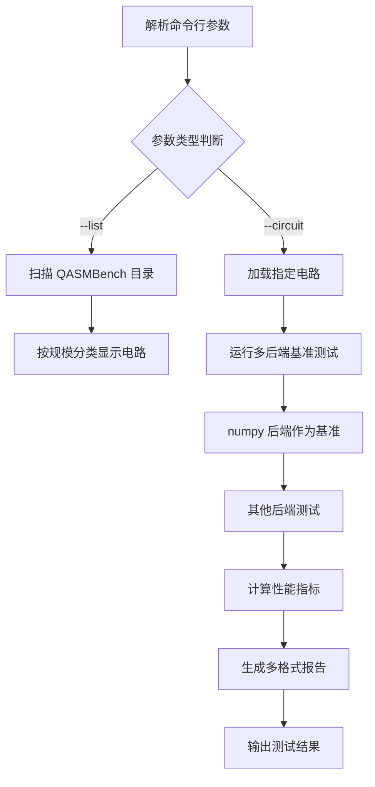

# qasmbench_runner.py 技术文档

## 概述

**脚本名称：** qasmbench_runner.py

**一句话简介：** 一个专用于 QASMBench 量子电路基准测试的自动化工具，能够加载 QASMBench 中的任意电路并对多个 Qibo 后端进行全面的性能比较分析。

**核心功能列表详解：**

| 参数 | 简写 | 类型 | 必填 | 默认值 | 说明 |
|------|------|------|------|--------|------|
| `--list` | 无 | bool | 否 | False | 列出所有可用的 QASMBench 电路 |
| `--circuit` | 无 | String | 否 | 无 | 指定 QASM 电路文件的完整路径进行基准测试 |

### 内置配置参数

| 配置项 | 默认值 | 说明 |
|--------|--------|------|
| `num_runs` | 5 | 每个后端正式运行的次数 |
| `warmup_runs` | 1 | 预热运行次数，用于 JIT 编译 |
| `output_formats` | ['csv', 'markdown', 'json'] | 支持的报告输出格式 |
| `baseline_backend` | "numpy" | 性能比较的基准后端 |
| `qasm_directory` | "../QASMBench" | QASMBench 电路根目录 |

### 支持的后端

| 后端名称 | 平台 | 说明 |
|----------|------|------|
| numpy | - | 基础 NumPy 后端（默认基准） |
| qibojit | numba | 高性能 JIT 编译后端 |
| qibotn | qutensornet | 张量网络后端 |
| qiboml | jax | JAX 深度学习后端 |
| qiboml | pytorch | PyTorch 深度学习后端 |
| qiboml | tensorflow | TensorFlow 深度学习后端 |
| qulacs | - | Qulacs 高性能后端 |

### 性能指标

| 指标名称 | 单位 | 说明 |
|----------|------|------|
| 执行时间均值 | 秒 | 多次运行的平均执行时间 |
| 执行时间标准差 | 秒 | 执行时间的统计标准差 |
| 峰值内存占用 | MB | 运行过程中的最大内存使用量 |
| 加速比 | 倍数 | 相对于基准后端的性能提升倍数 |
| 吞吐率 | 门/秒 | 每秒处理的量子门数量 |
| JIT 编译时间 | 秒 | 首次运行的编译时间 |
| 电路构建时间 | 秒 | 从 QASM 文件构建电路的时间 |
| 保真度 | 无 | 与基准结果的相似度（0-1） |

**使用示例：**

- **示例1：列出所有可用电路**
  ```bash
  python qasmbench_runner.py --list
  ```
  *说明：此命令会扫描 QASMBench 目录并列出所有可用的量子电路，按规模分类显示。*

- **示例2：测试指定电路**
  ```bash
  python qasmbench_runner.py --circuit ../QASMBench/medium/qft_n18/qft_n18_transpiled.qasm
  ```
  *说明：此命令会加载指定的 QASM 电路文件，在所有支持的后端上运行基准测试，并生成详细的性能报告。*

## 核心逻辑与架构

### 工作流程



### 架构设计

#### 1. 配置管理层 (`QASMBenchConfig`)
- 管理测试参数配置
- 定义默认测试环境
- 支持运行时参数调整

#### 2. 指标收集层 (`QASMBenchMetrics`)
- 存储和量化性能指标
- 支持多种性能数据类型
- 提供统一的指标接口

#### 3. 报告生成层 (`QASMBenchReporter`)
- 多格式报告生成（CSV、Markdown、JSON）
- 电路图可视化保存
- 环境信息记录

#### 4. 测试执行层 (`QASMBenchRunner`)
- QASM 电路加载和处理
- 多后端基准测试执行
- 正确性验证和性能比较

### 关键算法流程

#### 电路发现算法
1. 扫描 small、medium、large 三个规模目录
2. 识别每个电路目录中的 .qasm 文件
3. 优先选择 transpiled 版本（兼容性更好）
4. 构建电路元数据索引

#### 性能测试算法
1. 预热运行：触发 JIT 编译，初始化缓存
2. 正式测试：多次重复运行，收集时间数据
3. 内存监控：测量峰值内存使用
4. 结果验证：与基准后端比较正确性

#### 报告生成算法
1. 数据聚合：统计均值、标准差等指标
2. 性能排名：按执行时间排序后端
3. 格式转换：生成 CSV、Markdown、JSON 格式
4. 可视化：保存电路图和性能图表

## 核心类和函数详解

### 1. QASMBenchConfig 类

配置管理类，用于存储基准测试的所有参数。

```python
class QASMBenchConfig:
    def __init__(self):
        self.num_runs = 5                # 正式运行次数
        self.warmup_runs = 1             # 预热运行次数
        self.output_formats = ['csv', 'markdown', 'json']
        self.baseline_backend = "numpy"   # 基准后端
        self.qasm_directory = "../QASMBench"
```

**扩展方法：**
```python
# 添加自定义配置
def customize_config(self, custom_params):
    """添加自定义配置参数"""
    for key, value in custom_params.items():
        if hasattr(self, key):
            setattr(self, key, value)
        else:
            print(f"警告: 未知配置参数 {key}")
```

### 2. QASMBenchMetrics 类

性能指标存储类，用于收集和量化各种性能数据。

```python
class QASMBenchMetrics:
    def __init__(self):
        # 核心性能指标
        self.execution_time_mean = None
        self.execution_time_std = None
        self.peak_memory_mb = None
        self.speedup = None
        self.correctness = "Unknown"

        # 电路信息
        self.circuit_parameters = {}
        self.backend_info = {}

        # 性能分析
        self.throughput_gates_per_sec = None
        self.jit_compilation_time = None
        self.circuit_build_time = None
```

**扩展方法：**
```python
# 添加自定义指标
def add_custom_metric(self, metric_name, value, unit=""):
    """添加自定义性能指标"""
    setattr(self, f"custom_{metric_name}", value)
    if not hasattr(self, 'custom_metrics'):
        self.custom_metrics = {}
    self.custom_metrics[metric_name] = {"value": value, "unit": unit}

# 生成性能摘要
def generate_summary(self):
    """生成性能摘要字符串"""
    summary = []
    if self.execution_time_mean:
        summary.append(f"平均执行时间: {self.execution_time_mean:.4f}s")
    if self.speedup:
        summary.append(f"加速比: {self.speedup:.2f}x")
    if self.throughput_gates_per_sec:
        summary.append(f"吞吐率: {self.throughput_gates_per_sec:.0f} 门/秒")
    return "\n".join(summary)
```

### 3. QASMBenchRunner 类

核心测试执行类，负责基准测试的主要逻辑。

```python
class QASMBenchRunner:
    def __init__(self, config):
        self.config = config
        self.results = {}

    def discover_qasm_circuits(self):
        """发现所有可用的 QASMBench 电路"""
        # 扫描目录结构，构建电路索引
        pass

    def load_qasm_circuit(self, qasm_file_path):
        """加载 QASM 电路文件"""
        # 清理 barrier 语句，构建 Qibo 电路
        pass

    def run_benchmark_for_circuit(self, circuit_name, qasm_file_path):
        """运行完整的基准测试流程"""
        # 多后端测试、性能收集、正确性验证
        pass
```

### 4. QASMBenchReporter 类

报告生成类，支持多种格式的报告输出。

```python
class QASMBenchReporter:
    @staticmethod
    def generate_csv_report(results, circuit_name, filename=None):
        """生成 CSV 格式报告"""
        pass

    @staticmethod
    def generate_markdown_report(results, circuit_name, filename=None):
        """生成 Markdown 格式报告"""
        pass

    @staticmethod
    def generate_json_report(results, circuit_name, filename=None):
        """生成 JSON 格式报告"""
        pass
```

## 使用示例

### 示例1：完整基准测试流程

```python
#!/usr/bin/env python
"""
完整的 QASMBench 基准测试示例
"""

from qasmbench_runner import QASMBenchConfig, QASMBenchRunner, find_circuit_by_name

def run_complete_benchmark():
    """运行完整的基准测试流程"""

    # 1. 自定义配置
    config = QASMBenchConfig()
    config.num_runs = 10              # 增加运行次数
    config.warmup_runs = 2            # 增加预热次数
    config.output_formats = ['csv', 'markdown', 'json']

    # 2. 创建测试运行器
    runner = QASMBenchRunner(config)

    # 3. 查找并测试特定电路
    circuit_name = "medium/qft_n18"
    circuit_path = find_circuit_by_name(circuit_name)

    if circuit_path:
        print(f"开始测试电路: {circuit_name}")
        results = runner.run_benchmark_for_circuit(circuit_name, circuit_path)

        # 4. 生成报告
        runner.generate_reports(results, circuit_name)

        # 5. 显示结果摘要
        print_test_summary(results)
    else:
        print(f"未找到电路: {circuit_name}")

def print_test_summary(results):
    """打印测试结果摘要"""
    print("\n" + "="*60)
    print("基准测试结果摘要")
    print("="*60)

    successful = {k: v for k, v in results.items() if v.execution_time_mean}
    if successful:
        # 按性能排序
        sorted_results = sorted(successful.items(),
                             key=lambda x: x[1].execution_time_mean)

        print("性能排名（从快到慢）:")
        for i, (backend, metrics) in enumerate(sorted_results, 1):
            speedup = f" ({metrics.speedup:.2f}x)" if metrics.speedup else ""
            print(f"{i}. {backend}: {metrics.execution_time_mean:.4f}s{speedup}")
            print(f"   内存: {metrics.peak_memory_mb:.1f}MB | "
                  f"正确性: {metrics.correctness}")

if __name__ == "__main__":
    run_complete_benchmark()
```

### 示例2：批量电路测试

```python
#!/usr/bin/env python
"""
批量测试多个电路的性能
"""

from qasmbench_runner import QASMBenchConfig, QASMBenchRunner, list_available_circuits

def batch_test_circuits():
    """批量测试选定的电路"""

    # 配置测试参数
    config = QASMBenchConfig()
    config.num_runs = 3  # 减少运行次数以提高速度
    config.output_formats = ['csv']

    runner = QASMBenchRunner(config)

    # 获取所有可用电路
    all_circuits = list_available_circuits()

    # 选择要测试的电路（示例：选择部分 small 规模电路）
    test_circuits = []
    for circuit_name, info in all_circuits.items():
        if info['size'] == 'small' and len(test_circuits) < 3:
            test_circuits.append(circuit_name)

    print(f"选择测试的电路: {test_circuits}")

    # 批量测试
    all_results = {}
    for circuit_name in test_circuits:
        print(f"\n{'='*80}")
        print(f"测试电路: {circuit_name}")
        print(f"{'='*80}")

        circuit_path = find_circuit_by_name(circuit_name)
        if circuit_path:
            results = runner.run_benchmark_for_circuit(circuit_name, circuit_path)
            all_results[circuit_name] = results
            runner.generate_reports(results, circuit_name)

    # 生成汇总报告
    generate_batch_summary(all_results)

def generate_batch_summary(all_results):
    """生成批量测试汇总报告"""
    print("\n" + "="*80)
    print("批量测试汇总报告")
    print("="*80)

    for circuit_name, results in all_results.items():
        successful = {k: v for k, v in results.items() if v.execution_time_mean}
        if successful:
            fastest = min(successful.items(), key=lambda x: x[1].execution_time_mean)
            slowest = max(successful.items(), key=lambda x: x[1].execution_time_mean)

            print(f"\n电路: {circuit_name}")
            print(f"  最快后端: {fastest[0]} ({fastest[1].execution_time_mean:.4f}s)")
            print(f"  最慢后端: {slowest[0]} ({slowest[1].execution_time_mean:.4f}s)")
            print(f"  性能差异: {slowest[1].execution_time_mean/fastest[1].execution_time_mean:.2f}x")

if __name__ == "__main__":
    batch_test_circuits()
```

### 示例3：自定义性能分析

```python
#!/usr/bin/env python
"""
自定义性能分析和可视化
"""

import matplotlib.pyplot as plt
import numpy as np
from qasmbench_runner import QASMBenchConfig, QASMBenchRunner, find_circuit_by_name

def custom_performance_analysis():
    """执行自定义性能分析"""

    # 测试配置
    config = QASMBenchConfig()
    config.num_runs = 20  # 增加运行次数以获得更稳定的统计

    # 选择测试电路
    circuit_name = "small/ghz_n5"
    circuit_path = find_circuit_by_name(circuit_name)

    if not circuit_path:
        print(f"未找到电路: {circuit_name}")
        return

    # 运行基准测试
    runner = QASMBenchRunner(config)
    results = runner.run_benchmark_for_circuit(circuit_name, circuit_path)

    # 自定义分析
    analyze_performance_distribution(results)
    analyze_memory_usage(results)
    generate_performance_plots(results)

def analyze_performance_distribution(results):
    """分析性能分布"""
    print("\n性能分布分析:")
    print("-" * 40)

    # 收集执行时间数据
    times = []
    backends = []
    for backend, metrics in results.items():
        if metrics.execution_time_mean:
            times.append(metrics.execution_time_mean)
            backends.append(backend)

    if times:
        print(f"平均执行时间: {np.mean(times):.4f}s")
        print(f"执行时间标准差: {np.std(times):.4f}s")
        print(f"最快后端: {backends[np.argmin(times)]} ({np.min(times):.4f}s)")
        print(f"最慢后端: {backends[np.argmax(times)]} ({np.max(times):.4f}s)")

def analyze_memory_usage(results):
    """分析内存使用情况"""
    print("\n内存使用分析:")
    print("-" * 40)

    memory_data = []
    for backend, metrics in results.items():
        if metrics.peak_memory_mb:
            memory_data.append((backend, metrics.peak_memory_mb))

    if memory_data:
        memory_data.sort(key=lambda x: x[1])  # 按内存使用排序
        print("内存使用排名（从低到高）:")
        for i, (backend, memory) in enumerate(memory_data, 1):
            print(f"{i}. {backend}: {memory:.1f} MB")

def generate_performance_plots(results):
    """生成性能图表"""
    fig, ((ax1, ax2), (ax3, ax4)) = plt.subplots(2, 2, figsize=(15, 10))

    # 提取数据
    backends = []
    times = []
    memories = []
    throughputs = []

    for backend, metrics in results.items():
        if metrics.execution_time_mean:
            backends.append(backend)
            times.append(metrics.execution_time_mean)
            memories.append(metrics.peak_memory_mb or 0)
            throughputs.append(metrics.throughput_gates_per_sec or 0)

    if not backends:
        print("没有有效数据用于绘图")
        return

    # 1. 执行时间对比
    ax1.bar(backends, times)
    ax1.set_title('执行时间对比')
    ax1.set_ylabel('时间 (秒)')
    ax1.tick_params(axis='x', rotation=45)

    # 2. 内存使用对比
    ax2.bar(backends, memories)
    ax2.set_title('内存使用对比')
    ax2.set_ylabel('内存 (MB)')
    ax2.tick_params(axis='x', rotation=45)

    # 3. 吞吐率对比
    ax3.bar(backends, throughputs)
    ax3.set_title('吞吐率对比')
    ax3.set_ylabel('门/秒')
    ax3.tick_params(axis='x', rotation=45)

    # 4. 性能雷达图
    categories = ['速度', '内存效率', '吞吐率']
    angles = np.linspace(0, 2 * np.pi, len(categories), endpoint=False).tolist()
    angles += angles[:1]  # 闭合图形

    ax4 = plt.subplot(2, 2, 4, projection='polar')

    for i, backend in enumerate(backends):
        # 归一化数据（0-1范围）
        speed_score = 1 - (times[i] - min(times)) / (max(times) - min(times))
        memory_score = 1 - (memories[i] - min(memories)) / (max(memories) - min(memories)) if max(memories) > min(memories) else 1
        throughput_score = (throughputs[i] - min(throughputs)) / (max(throughputs) - min(throughputs)) if max(throughputs) > min(throughputs) else 1

        values = [speed_score, memory_score, throughput_score]
        values += values[:1]  # 闭合图形

        ax4.plot(angles, values, 'o-', linewidth=2, label=backend)
        ax4.fill(angles, values, alpha=0.25)

    ax4.set_xticks(angles[:-1])
    ax4.set_xticklabels(categories)
    ax4.set_ylim(0, 1)
    ax4.set_title('综合性能雷达图')
    ax4.legend()

    plt.tight_layout()
    plt.savefig('qasmbench_performance_analysis.png', dpi=300, bbox_inches='tight')
    plt.show()

    print("性能分析图表已保存为: qasmbench_performance_analysis.png")

if __name__ == "__main__":
    custom_performance_analysis()
```

## 扩展指南

### 1. 添加新的性能指标

**如何扩展：** 在 `QASMBenchMetrics` 类中添加新的指标字段，并在测试执行过程中收集相应数据。

```python
# 在 QASMBenchMetrics.__init__ 中添加新指标
def __init__(self):
    # ... 现有指标 ...
    self.energy_consumption = None  # 新增：能耗指标
    self.cache_hit_rate = None      # 新增：缓存命中率
    self.parallel_efficiency = None # 新增：并行效率

# 在 _run_single_backend_benchmark 中收集新指标
def _run_single_backend_benchmark(self, ...):
    # ... 现有代码 ...

    # 收集能耗数据（示例）
    start_energy = self.measure_energy_consumption()
    result = circuit()
    end_energy = self.measure_energy_consumption()
    metrics.energy_consumption = end_energy - start_energy

    # 收集缓存命中率（示例）
    metrics.cache_hit_rate = self.get_cache_hit_rate()

    # 收集并行效率（示例）
    metrics.parallel_efficiency = self.calculate_parallel_efficiency()

# 辅助方法
def measure_energy_consumption(self):
    """测量能耗（需要相应的硬件支持）"""
    try:
        # 这里需要根据实际硬件平台实现
        # 例如使用 Intel RAPL 或其他功耗监控工具
        import subprocess
        result = subprocess.run(['powerstat'], capture_output=True, text=True)
        return float(result.stdout.split()[0])
    except:
        return 0.0

def get_cache_hit_rate(self):
    """获取缓存命中率"""
    # 这里需要根据具体后端实现
    return 0.95  # 示例值

def calculate_parallel_efficiency(self):
    """计算并行效率"""
    # 这里需要根据具体的并行实现计算
    return 0.88  # 示例值
```

### 2. 添加新的报告格式

**如何扩展：** 在 `QASMBenchReporter` 类中添加新的报告生成方法。

```python
class QASMBenchReporter:
    # ... 现有方法 ...

    @staticmethod
    def generate_html_report(results, circuit_name, filename=None):
        """生成 HTML 格式报告"""
        if filename is None:
            clean_circuit_name = circuit_name.replace('/', '_').replace('\\', '_')
            report_dir = f"qibobench/reports/{clean_circuit_name}"
            filename = f"{report_dir}/benchmark_report.html"

        os.makedirs(os.path.dirname(filename), exist_ok=True)

        # HTML 模板
        html_template = """
<!DOCTYPE html>
<html>
<head>
    <title>QASMBench 报告: {circuit_name}</title>
    <style>
        body {{ font-family: Arial, sans-serif; margin: 40px; }}
        table {{ border-collapse: collapse; width: 100%; }}
        th, td {{ border: 1px solid #ddd; padding: 8px; text-align: left; }}
        th {{ background-color: #f2f2f2; }}
        .chart {{ margin: 20px 0; }}
    </style>
    <script src="https://cdn.jsdelivr.net/npm/chart.js"></script>
</head>
<body>
    <h1>QASMBench 电路基准测试报告: {circuit_name}</h1>
    <p>生成时间: {timestamp}</p>

    <h2>测试结果</h2>
    <table>
        <tr>
            <th>后端</th>
            <th>执行时间(秒)</th>
            <th>标准差(秒)</th>
            <th>内存(MB)</th>
            <th>加速比</th>
            <th>正确性</th>
        </tr>
        {table_rows}
    </table>

    <div class="chart">
        <canvas id="performanceChart" width="400" height="200"></canvas>
    </div>

    <script>
        var ctx = document.getElementById('performanceChart').getContext('2d');
        var chart = new Chart(ctx, {{
            type: 'bar',
            data: {{
                labels: {backend_labels},
                datasets: [{{
                    label: '执行时间 (秒)',
                    data: {execution_times},
                    backgroundColor: 'rgba(54, 162, 235, 0.2)',
                    borderColor: 'rgba(54, 162, 235, 1)',
                    borderWidth: 1
                }}]
            }},
            options: {{
                responsive: true,
                scales: {{
                    y: {{
                        beginAtZero: true
                    }}
                }}
            }}
        }});
    </script>
</body>
</html>
        """

        # 生成表格数据
        table_rows = ""
        backend_labels = []
        execution_times = []

        for backend_name, metrics in results.items():
            if metrics.execution_time_mean is not None:
                table_rows += f"""
                <tr>
                    <td>{backend_name}</td>
                    <td>{metrics.execution_time_mean:.6f}</td>
                    <td>{metrics.execution_time_std:.6f if metrics.execution_time_std else 'N/A'}</td>
                    <td>{metrics.peak_memory_mb:.2f if metrics.peak_memory_mb else 'N/A'}</td>
                    <td>{metrics.speedup:.2f}x' if metrics.speedup else 'N/A'}</td>
                    <td>{metrics.correctness}</td>
                </tr>
                """
                backend_labels.append(backend_name)
                execution_times.append(metrics.execution_time_mean)

        # 填充模板
        html_content = html_template.format(
            circuit_name=circuit_name,
            timestamp=datetime.now().strftime('%Y-%m-%d %H:%M:%S'),
            table_rows=table_rows,
            backend_labels=backend_labels,
            execution_times=execution_times
        )

        with open(filename, 'w', encoding='utf-8') as f:
            f.write(html_content)

        print(f"HTML报告已生成: {filename}")

    @staticmethod
    def generate_xml_report(results, circuit_name, filename=None):
        """生成 XML 格式报告"""
        if filename is None:
            clean_circuit_name = circuit_name.replace('/', '_').replace('\\', '_')
            report_dir = f"qibobench/reports/{clean_circuit_name}"
            filename = f"{report_dir}/benchmark_report.xml"

        os.makedirs(os.path.dirname(filename), exist_ok=True)

        # XML 模板
        xml_content = f"""<?xml version="1.0" encoding="UTF-8"?>
<benchmark_report>
    <metadata>
        <circuit_name>{circuit_name}</circuit_name>
        <generation_time>{datetime.now().isoformat()}</generation_time>
    </metadata>
    <results>
"""

        for backend_name, metrics in results.items():
            if metrics.execution_time_mean is not None:
                xml_content += f"""
        <backend name="{backend_name}">
            <execution_time>
                <mean>{metrics.execution_time_mean}</mean>
                <std>{metrics.execution_time_std or 0}</std>
            </execution_time>
            <memory_mb>{metrics.peak_memory_mb or 0}</memory_mb>
            <speedup>{metrics.speedup or 0}</speedup>
            <correctness>{metrics.correctness}</correctness>
            <throughput_gates_per_sec>{metrics.throughput_gates_per_sec or 0}</throughput_gates_per_sec>
        </backend>
"""

        xml_content += """    </results>
</benchmark_report>"""

        with open(filename, 'w', encoding='utf-8') as f:
            f.write(xml_content)

        print(f"XML报告已生成: {filename}")
```

### 3. 添加新的后端支持

**如何扩展：** 在后端配置字典中添加新的后端配置。

```python
# 在 run_benchmark_for_circuit 方法中扩展后端配置
def run_benchmark_for_circuit(self, circuit_name, qasm_file_path):
    # 扩展后端配置
    backend_configs = {
        # ... 现有后端 ...
        "custom_backend": {"backend_name": "custom_backend", "platform_name": None},
        "quantum_simulator": {"backend_name": "quantum_simulator", "platform_name": "gpu"},
        "tensor_network": {"backend_name": "tensor_network", "platform_name": "cuda"}
    }

    # 可能需要为特殊后端添加自定义处理逻辑
    for backend_key, config in backend_configs.items():
        if backend_key == "custom_backend":
            result, metrics = self._run_custom_backend_benchmark(
                backend_key, config, qasm_file_path, baseline_result
            )
        else:
            result, metrics = self._run_single_backend_benchmark(
                backend_key, config["backend_name"], config["platform_name"],
                qasm_file_path, baseline_result
            )
        results[backend_key] = metrics

def _run_custom_backend_benchmark(self, backend_key, config, qasm_file_path, baseline_result=None):
    """为自定义后端运行基准测试"""
    metrics = QASMBenchMetrics()

    try:
        # 自定义后端的特殊处理逻辑
        print(f"初始化自定义后端: {backend_key}")

        # 这里可以添加自定义后端的初始化代码
        # 例如：加载特定的库、设置特殊参数等

        # 然后调用标准的测试流程
        return self._run_single_backend_benchmark(
            backend_key, config["backend_name"], config.get("platform_name"),
            qasm_file_path, baseline_result
        )

    except Exception as e:
        print(f"❌ 自定义后端 {backend_key} 测试失败: {str(e)}")
        metrics.correctness = "Failed"
        return None, metrics
```

### 4. 添加新的电路规模分类

**如何扩展：** 在电路发现算法中添加新的规模分类。

```python
def discover_qasm_circuits(self):
    """发现QASMBench中所有可用的电路"""
    circuits = {}

    # 扩展规模分类
    size_categories = ['tiny', 'small', 'medium', 'large', 'xlarge', 'xxlarge']

    for size in size_categories:
        size_dir = os.path.join(self.config.qasm_directory, size)
        if os.path.exists(size_dir):
            print(f"搜索目录: {size_dir}")
            # ... 现有的电路发现逻辑 ...

            # 为不同规模添加特殊处理
            if size in ['xlarge', 'xxlarge']:
                # 大规模电路可能需要特殊配置
                print(f"检测到大规模电路 ({size})，建议增加内存和运行时间")
                config_override = {
                    'num_runs': 3,  # 减少运行次数
                    'warmup_runs': 1
                }
                # 应用配置覆盖
                for key, value in config_override.items():
                    setattr(self.config, key, value)

    return circuits
```

## 常见问题与故障排除

### 问题1：`ModuleNotFoundError: No module named 'qibo'`

**原因：** 未安装 Qibo 量子计算框架。

**解决方法：**
```bash
# 基础安装
pip install qibo

# 完整安装（推荐）
pip install qibo[qibojit,qiboml,qibotn]

# 验证安装
python -c "import qibo; print('Qibo 安装成功')"
```

### 问题2：`FileNotFoundError: ../QASMBench 目录不存在`

**原因：** QASMBench 电路库目录路径不正确或未下载。

**解决方法：**
```bash
# 1. 确认 QASMBench 目录位置
ls -la ../  # 查看上级目录

# 2. 下载 QASMBench（如果不存在）
git clone https://github.com/qiboteam/QASMBench.git

# 3. 或者在配置中指定正确路径
# 修改 QASMBenchConfig.qasm_directory
```

### 问题3：`QASM 解析错误：不支持 barrier 语句`

**原因：** QASM 文件包含 Qibo 不支持的语句。

**解决方法：**
```python
# 脚本已经自动处理 barrier 语句
# 如果仍有问题，可以手动清理 QASM 文件
def clean_qasm_file(qasm_file_path):
    """手动清理 QASM 文件"""
    with open(qasm_file_path, 'r') as f:
        content = f.read()

    # 移除不支持的语句
    unsupported_statements = ['barrier', 'opaque', 'if']
    for stmt in unsupported_statements:
        content = re.sub(f'{stmt}.*', '', content)

    # 保存清理后的文件
    clean_path = qasm_file_path.replace('.qasm', '_clean.qasm')
    with open(clean_path, 'w') as f:
        f.write(content)

    return clean_path
```

### 问题4：`内存不足错误`

**原因：** 测试电路规模过大，超出系统内存限制。

**解决方法：**
```python
# 调整配置以减少内存使用
config = QASMBenchConfig()
config.num_runs = 1        # 减少运行次数
config.warmup_runs = 0     # 跳过预热运行

# 或者选择更小的电路进行测试
small_circuits = [c for c in all_circuits if 'small' in c]
```

### 问题5：`后端切换失败`

**原因：** 目标后端未安装或配置不正确。

**解决方法：**
```bash
# 安装特定后端依赖
pip install numba          # qibojit 后端
pip install qibotn          # qibotn 后端
pip install torch           # pytorch 后端
pip install jax             # jax 后端
pip install tensorflow      # tensorflow 后端
pip install qulacs          # qulacs 后端

# 测试后端可用性
python -c "
import qibo
for backend in ['numpy', 'qibojit', 'qibotn']:
    try:
        qibo.set_backend(backend)
        print(f'✅ {backend} 后端可用')
    except Exception as e:
        print(f'❌ {backend} 后端不可用: {e}')
"
```

### 问题6：`报告生成失败`

**原因：** 输出目录权限不足或磁盘空间不足。

**解决方法：**
```python
# 检查目录权限
import os
report_dir = "qibobench/reports"
os.makedirs(report_dir, exist_ok=True)

# 检查磁盘空间
import shutil
total, used, free = shutil.disk_usage(".")
print(f"可用磁盘空间: {free / 1024**3:.2f} GB")

# 修改输出目录
config.output_formats = ['csv']  # 只生成 CSV 格式
```

### 问题7：`电路执行超时`

**原因：** 电路过于复杂或后端性能不足。

**解决方法：**
```python
import signal
from contextlib import contextmanager

@contextmanager
def timeout_context(seconds):
    """设置超时上下文"""
    def timeout_handler(signum, frame):
        raise TimeoutError(f"操作超时 ({seconds}秒)")

    old_handler = signal.signal(signal.SIGALRM, timeout_handler)
    signal.alarm(seconds)
    try:
        yield
    finally:
        signal.alarm(0)
        signal.signal(signal.SIGALRM, old_handler)

# 在电路执行中使用超时
try:
    with timeout_context(300):  # 5分钟超时
        result = circuit()
except TimeoutError:
    print("电路执行超时，尝试简化配置")
    # 减少运行次数或选择更简单的电路
```

### 问题8：`JIT 编译错误`

**原因：** numba JIT 编译器遇到不支持的代码模式。

**解决方法：**
```python
# 禁用 JIT 编译或调整配置
import os
os.environ['NUMBA_DISABLE_JIT'] = '1'  # 禁用 JIT

# 或者调整 numba 配置
import numba
numba.config.THREADING_LAYER = 'safe'  # 使用安全线程层
numba.config.NUMBA_NUM_THREADS = 1     # 单线程执行
```

### 问题9：`GPU 后端不可用`

**原因：** GPU 驱动未安装或 CUDA 环境配置不正确。

**解决方法：**
```bash
# 检查 CUDA 可用性
nvidia-smi

# 检查 PyTorch CUDA 支持
python -c "
import torch
print(f'CUDA 可用: {torch.cuda.is_available()}')
if torch.cuda.is_available():
    print(f'GPU 数量: {torch.cuda.device_count()}')
    print(f'当前设备: {torch.cuda.get_device_name()}')
"

# 安装 GPU 版本的深度学习框架
pip install torch torchvision torchaudio --index-url https://download.pytorch.org/whl/cu118
pip install jax[cuda12] -f https://storage.googleapis.com/jax-releases/jax_cuda_releases.html
```

### 问题10：`结果不一致或正确性验证失败`

**原因：** 不同后端的数值精度差异或实现差异。

**解决方法：**
```python
# 调整正确性验证阈值
def validate_correctness_with_tolerance(result, baseline_result, tolerance=0.95):
    """使用容差进行正确性验证"""
    try:
        if result is None or baseline_result is None:
            return "Failed - Missing result"

        current_state = self._convert_to_numpy(result.state())
        baseline_state = self._convert_to_numpy(baseline_result.state())

        # 计算保真度
        fidelity = np.abs(np.vdot(current_state, baseline_state))

        if fidelity > tolerance:
            return f"Passed (fidelity: {fidelity:.6f})"
        else:
            return f"Failed (fidelity: {fidelity:.6f})"

    except Exception as e:
        return f"Failed - {str(e)}"

# 在测试中使用更宽松的阈值
metrics.correctness = validate_correctness_with_tolerance(result, baseline_result, tolerance=0.90)
```

---

**文档版本：** 1.0
**最后更新：** 2025-10-27
**作者：** QASMBench 开发团队

这份技术文档提供了 `qasmbench_runner.py` 脚本的完整使用指南，从基本概念到高级扩展，帮助用户充分利用该工具进行量子电路性能基准测试。