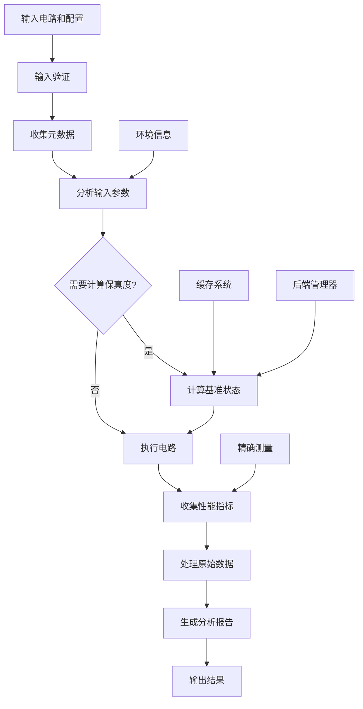

# qibo_profiler.py 技术文档

## 概述

**脚本名称：** qibo_profiler.py

**一句话简介：** 一个用于对 Qibo 量子计算框架进行深度性能分析和基准测试的专业工具，提供精确的运行时间、内存使用、CPU利用率和状态保真度等关键性能指标。

**核心功能列表：**
- 高精度性能测量（运行时间、CPU时间、内存使用）
- 多后端支持（numpy、qibojit、qibotn、qiboml等）
- 量子电路状态保真度计算
- 线程安全的缓存系统
- 自动化的环境信息收集
- 详细的性能报告生成（Markdown格式）
- 多种运行模式（basic、detailed、comprehensive）
- 异常处理和错误恢复机制
- 向后兼容性支持

## 安装与环境配置

### 必需依赖

```bash
# 核心依赖
pip install qibo
pip install numpy
pip install psutil
pip install py-cpuinfo

# 可选后端依赖
pip install qibo[qibojit]  # 高性能 JIT 编译
pip install torch          # PyTorch 后端支持
pip install jax            # JAX 后端支持
pip install tensorflow     # TensorFlow 后端支持
```

### 环境要求

- Python 3.7+
- 足够的内存（建议至少 4GB）
- 支持多核 CPU（推荐）

## API 参考

### 主要 API 函数

#### `profile_circuit()`

分析量子电路的性能和保真度（推荐使用）

```python
def profile_circuit(circuit: Circuit,
                   n_runs: int = 1,
                   mode: str = 'basic',
                   calculate_fidelity: bool = True,
                   initial_state=None,
                   timeout_seconds: float = 300.0) -> dict:
```

**参数：**
| 参数 | 类型 | 必填 | 默认值 | 说明 |
|------|------|------|--------|------|
| `circuit` | Circuit | 是 | 无 | 待分析的 Qibo 量子电路 |
| `n_runs` | int | 否 | 1 | 运行次数，用于统计计算 |
| `mode` | str | 否 | 'basic' | 分析模式：'basic'/'detailed'/'comprehensive' |
| `calculate_fidelity` | bool | 否 | True | 是否计算与基准状态的保真度 |
| `initial_state` | ndarray | 否 | None | 自定义初始量子状态 |
| `timeout_seconds` | float | 否 | 300.0 | 单次运行超时时间（秒） |

**返回值：**
```python
{
    "metadata": {
        "profiler_version": "1.0",
        "timestamp_utc": "2025-10-27T14:30:00Z"
    },
    "inputs": {
        "profiler_settings": {...},
        "circuit_properties": {...},
        "environment": {...}
    },
    "results": {
        "summary": {...},
        "raw_metrics": {...}
    },
    "error": None  # 如果出错则包含错误信息
}
```

#### `generate_markdown_report()`

将性能分析结果转换为 Markdown 格式报告

```python
def generate_markdown_report(report: dict,
                           output_path: Optional[str] = None,
                           default_dir: Optional[str] = None) -> str:
```

**参数：**
| 参数 | 类型 | 必填 | 默认值 | 说明 |
|------|------|------|--------|------|
| `report` | dict | 是 | 无 | profile_circuit 返回的分析报告 |
| `output_path` | str | 否 | None | 自定义输出文件路径 |
| `default_dir` | str | 否 | None | 默认输出目录 |

**返回值：** 生成的 Markdown 报告文件路径

#### `profile_circuit_legacy()`

向后兼容的性能分析函数

```python
def profile_circuit_legacy(circuit: Circuit, n_runs=1, mode='basic', calculate_fidelity=True, initial_state=None) -> dict:
```

### 配置类

#### `ProfilerConfig`

分析器配置类，用于控制分析行为

```python
@dataclass
class ProfilerConfig:
    n_runs: int = 1              # 运行次数
    mode: str = 'basic'          # 分析模式
    calculate_fidelity: bool = True  # 是否计算保真度
    timeout_seconds: float = 300.0   # 超时时间
    version: str = "1.0"         # 分析器版本
```

## 使用示例

### 示例1：基本性能分析

```python
import qibo
from qibo import gates
from qibo_profiler import profile_circuit, generate_markdown_report

# 创建一个简单的量子电路
circuit = qibo.models.Circuit(3)
circuit.add(gates.H(0))
circuit.add(gates.CNOT(0, 1))
circuit.add(gates.CNOT(1, 2))
circuit.add(gates.M(0, 1, 2))

# 执行性能分析
report = profile_circuit(
    circuit=circuit,
    n_runs=5,
    mode='basic',
    calculate_fidelity=True
)

# 生成 Markdown 报告
report_path = generate_markdown_report(report)
print(f"性能报告已生成: {report_path}")
```

**说明：** 此示例创建了一个3量子比特的电路，执行5次运行测试，并生成包含性能指标和保真度的详细报告。

### 示例2：高级性能分析

```python
import numpy as np
from qibo_profiler import profile_circuit, ProfilerConfig

# 创建复杂电路
circuit = qibo.models.Circuit(4)
# 添加量子傅里叶变换
circuit.add(gates.H(i) for i in range(4))
for i in range(4):
    for j in range(i+1, 4):
        circuit.add(gates.CU1(i, j, np.pi/2**(j-i)))
for i in range(2):
    circuit.add(gates.SWAP(i, 3-i))

# 自定义配置
config = ProfilerConfig(
    n_runs=10,
    mode='comprehensive',
    calculate_fidelity=True,
    timeout_seconds=600.0
)

# 执行分析
report = profile_circuit(circuit, **config.__dict__)

# 提取关键性能指标
summary = report['results']['summary']
print(f"平均运行时间: {summary['runtime_avg']['value']:.4f} 秒")
print(f"CPU利用率: {summary['cpu_utilization_avg']['value']:.2f}%")
print(f"峰值内存: {summary['memory_usage_peak']['value']:.2f} MiB")
if summary.get('fidelity', {}).get('value') is not None:
    print(f"状态保真度: {summary['fidelity']['value']:.6f}")
```

**说明：** 此示例展示了如何使用自定义配置进行深度性能分析，包括多次运行的统计分析和详细的内存使用情况。

### 示例3：不同后端性能比较

```python
import qibo
from qibo_profiler import profile_circuit

# 创建测试电路
circuit = qibo.models.Circuit(5)
circuit.add(gates.H(i) for i in range(5))
for i in range(4):
    circuit.add(gates.CNOT(i, i+1))

# 测试不同后端
backends = [
    ("numpy", None),
    ("qibojit", "numba"),
]

results = {}

for backend_name, platform in backends:
    try:
        # 切换后端
        qibo.set_backend(backend_name, platform=platform)

        # 执行分析
        report = profile_circuit(
            circuit=circuit,
            n_runs=5,
            mode='detailed',
            calculate_fidelity=True
        )

        # 记录结果
        key = f"{backend_name}_{platform or 'default'}"
        summary = report['results']['summary']
        results[key] = {
            'runtime': summary['runtime_avg']['value'],
            'memory': summary['memory_usage_peak']['value'],
            'fidelity': summary.get('fidelity', {}).get('value')
        }

        print(f"{key}: 运行时间={summary['runtime_avg']['value']:.4f}s, "
              f"内存={summary['memory_usage_peak']['value']:.2f}MiB")

    except Exception as e:
        print(f"后端 {backend_name} 测试失败: {str(e)}")

# 比较结果
print("\n=== 性能比较 ===")
for backend, metrics in results.items():
    print(f"{backend}: {metrics}")
```

**说明：** 此示例展示了如何在不同的 Qibo 后端之间进行性能比较，帮助选择最适合的计算后端。

### 示例4：批量电路分析

```python
import os
from qibo_profiler import profile_circuit, generate_markdown_report

def create_test_circuits():
    """创建一组测试电路"""
    circuits = []

    # 电路1: 简单的贝尔态
    bell_circuit = qibo.models.Circuit(2)
    bell_circuit.add(gates.H(0))
    bell_circuit.add(gates.CNOT(0, 1))
    circuits.append(("Bell_State", bell_circuit))

    # 电路2: GHZ态
    ghz_circuit = qibo.models.Circuit(3)
    ghz_circuit.add(gates.H(0))
    ghz_circuit.add(gates.CNOT(0, 1))
    ghz_circuit.add(gates.CNOT(1, 2))
    circuits.append(("GHZ_State", ghz_circuit))

    # 电路3: 随机电路
    random_circuit = qibo.models.Circuit(4)
    random_circuit.add(gates.H(i) for i in range(4))
    for i in range(4):
        random_circuit.add(gates.RX(i, np.random.random()))
        random_circuit.add(gates.RY(i, np.random.random()))
        random_circuit.add(gates.RZ(i, np.random.random()))
    circuits.append(("Random_Circuit_4q", random_circuit))

    return circuits

# 创建输出目录
output_dir = "benchmark_results"
os.makedirs(output_dir, exist_ok=True)

# 批量分析
test_circuits = create_test_circuits()
summary_results = []

for name, circuit in test_circuits:
    print(f"\n分析电路: {name}")

    try:
        # 执行性能分析
        report = profile_circuit(
            circuit=circuit,
            n_runs=10,
            mode='comprehensive',
            calculate_fidelity=True
        )

        # 生成单独的报告
        report_path = generate_markdown_report(
            report,
            output_path=os.path.join(output_dir, f"{name}_report.md")
        )

        # 收集摘要数据
        summary = report['results']['summary']
        summary_results.append({
            'circuit': name,
            'qubits': report['inputs']['circuit_properties']['n_qubits'],
            'gates': report['inputs']['circuit_properties']['total_gates'],
            'runtime': summary['runtime_avg']['value'],
            'memory': summary['memory_usage_peak']['value'],
            'fidelity': summary.get('fidelity', {}).get('value', 'N/A')
        })

        print(f"  运行时间: {summary['runtime_avg']['value']:.4f}s")
        print(f"  报告已保存: {report_path}")

    except Exception as e:
        print(f"  分析失败: {str(e)}")
        summary_results.append({
            'circuit': name,
            'error': str(e)
        })

# 生成汇总报告
print(f"\n=== 批量分析汇总 ===")
for result in summary_results:
    if 'error' not in result:
        print(f"{result['circuit']}: {result['runtime']:.4f}s, "
              f"{result['qubits']}q, {result['gates']} gates")
    else:
        print(f"{result['circuit']}: 失败 - {result['error']}")
```

**说明：** 此示例展示了如何对多个电路进行批量性能分析，并生成汇总报告，非常适合用于算法比较和性能评估。

## 核心逻辑与架构

### 工作流程



### 架构组件

#### 1. 输入验证层 (`InputValidator`)
- 电路验证：检查量子比特数、门数量等
- 配置验证：验证运行次数、模式等参数
- 初始状态验证：确保状态向量格式正确

#### 2. 缓存系统 (`ThreadSafeCache`, `EnvironmentCache`)
- 线程安全的状态缓存
- 环境信息缓存（带TTL）
- LRU清理策略

#### 3. 后端管理 (`SafeBackendManager`)
- 安全的后端切换
- 自动回滚机制
- 错误处理和恢复

#### 4. 性能测量 (`PrecisionMeasurement`)
- 高精度时间测量
- CPU使用率监控
- 内存使用跟踪
- 垃圾回收优化

#### 5. 分析管道 (`ProfilerPipeline`)
- 模块化设计
- 依赖注入
- 错误上下文收集

### 数据流

1. **输入阶段**: 验证电路、配置和环境
2. **分析阶段**: 收集电路属性和环境信息
3. **基准阶段**: 计算参考状态（可选）
4. **执行阶段**: 运行电路并收集性能数据
5. **处理阶段**: 计算统计指标和保真度
6. **输出阶段**: 生成结构化报告

## 扩展点

### 1. 添加新的性能指标

```python
# 在 ResultProcessor.process() 方法中添加新指标
def process(self, raw_data: dict, benchmark_state: Optional[np.ndarray] = None) -> dict:
    # ... 现有代码 ...

    # 添加自定义指标
    summary["custom_metric"] = {
        "value": self._calculate_custom_metric(raw_data),
        "unit": "custom_unit"
    }

    return {
        "summary": summary,
        "raw_metrics": raw_metrics
    }

def _calculate_custom_metric(self, raw_data: dict) -> float:
    """计算自定义性能指标"""
    # 实现自定义指标计算逻辑
    wall_runtimes = raw_data["wall_runtimes"]
    return np.max(wall_runtimes) - np.min(wall_runtimes)  # 示例：运行时间范围
```

### 2. 添加新的后端支持

```python
# 在 SUPPORTED_BACKENDS 字典中添加新后端
SUPPORTED_BACKENDS = {
    # ... 现有后端 ...
    "custom_backend": {
        "backend_name": "custom_backend_name",
        "platform_name": "custom_platform"
    }
}

# 在 BenchmarkManager 中添加特殊处理逻辑
def get_benchmark_state(self, circuit: Circuit, circuit_hash: str, initial_state=None) -> np.ndarray:
    # ... 现有代码 ...

    # 添加新后端的处理逻辑
    if current_backend_name == "custom_backend":
        state = self._compute_state_with_custom_backend(circuit, initial_state)
        # ... 处理逻辑 ...

    # ... 现有代码 ...

def _compute_state_with_custom_backend(self, circuit: Circuit, initial_state=None) -> np.ndarray:
    """使用自定义后端计算状态"""
    # 实现自定义后端的特殊处理逻辑
    pass
```

### 3. 添加新的报告格式

```python
def generate_json_report(report: dict, output_path: Optional[str] = None) -> str:
    """生成 JSON 格式的报告"""
    if output_path is None:
        timestamp = datetime.datetime.now().strftime("%Y%m%d_%H%M%S")
        output_path = f"qibo_report_{timestamp}.json"

    try:
        with open(output_path, 'w', encoding='utf-8') as f:
            json.dump(report, f, indent=2, ensure_ascii=False, default=str)
    except Exception as e:
        logging.error(f"无法写入JSON报告文件 {output_path}: {str(e)}")
        raise

    return output_path

def generate_csv_summary(report: dict, output_path: Optional[str] = None) -> str:
    """生成 CSV 格式的摘要报告"""
    if output_path is None:
        timestamp = datetime.datetime.now().strftime("%Y%m%d_%H%M%S")
        output_path = f"qibo_summary_{timestamp}.csv"

    # 提取摘要数据
    summary = report['results']['summary']
    circuit_props = report['inputs']['circuit_properties']

    csv_data = {
        "指标": ["运行时间(秒)", "CPU利用率(%)", "内存使用(MiB)", "量子比特数", "门数量"],
        "值": [
            summary['runtime_avg']['value'],
            summary['cpu_utilization_avg']['value'],
            summary['memory_usage_peak']['value'],
            circuit_props['n_qubits'],
            circuit_props['total_gates']
        ]
    }

    df = pd.DataFrame(csv_data)
    df.to_csv(output_path, index=False, encoding='utf-8')

    return output_path
```

### 4. 添加自定义分析模式

```python
class CustomAnalyzer:
    """自定义分析器"""

    def analyze(self, circuit: Circuit, raw_data: dict) -> dict:
        """执行自定义分析"""
        # 实现自定义分析逻辑
        return {
            "custom_metrics": self._calculate_custom_metrics(circuit, raw_data),
            "insights": self._generate_insights(circuit, raw_data)
        }

    def _calculate_custom_metrics(self, circuit: Circuit, raw_data: dict) -> dict:
        """计算自定义指标"""
        return {
            "gate_efficiency": len(circuit.queue) / raw_data["wall_runtimes"][0],
            "memory_efficiency": raw_data["peak_memory_usage"] / circuit.nqubits
        }

    def _generate_insights(self, circuit: Circuit, raw_data: dict) -> list:
        """生成性能洞察"""
        insights = []

        # 分析运行时间模式
        runtimes = raw_data["wall_runtimes"]
        if np.std(runtimes) > np.mean(runtimes) * 0.1:
            insights.append("运行时间波动较大，可能存在系统负载影响")

        # 分析内存使用模式
        if raw_data["peak_memory_usage"] > 1000:  # 超过1GB
            insights.append("内存使用较高，建议优化电路或增加系统内存")

        return insights

# 在 ProfilerPipeline 中集成自定义分析器
class ProfilerPipeline:
    def __init__(self, ..., custom_analyzer: Optional[CustomAnalyzer] = None):
        # ... 现有代码 ...
        self.custom_analyzer = custom_analyzer or CustomAnalyzer()

    def execute(self, circuit: Circuit, config: ProfilerConfig, initial_state=None) -> dict:
        # ... 现有分析代码 ...

        # 添加自定义分析
        if config.mode == 'custom':
            custom_results = self.custom_analyzer.analyze(circuit, raw_data)
            report["results"]["custom_analysis"] = custom_results

        return report
```

## 常见问题与故障排除

### 问题1：`ImportError: No module named 'qibo'`

**原因：** 未安装 Qibo 量子计算框架。

**解决方法：**
```bash
# 基础安装
pip install qibo

# 包含高性能后端的完整安装
pip install qibo[qibojit]
```

### 问题2：`BackendError: 无法切换到后端 qibojit`

**原因：** QiboJIT 后端未正确安装或配置。

**解决方法：**
```bash
# 确保安装了 numba
pip install numba

# 重新安装 qibo
pip uninstall qibo
pip install qibo[qibojit]

# 验证安装
python -c "import qibo; qibo.set_backend('qibojit')"
```

### 问题3：`MeasurementError: 状态计算失败`

**原因：** 电路过于复杂或内存不足。

**解决方法：**
```python
# 减少量子比特数
circuit = qibo.models.Circuit(3)  # 而不是更大的数

# 增加超时时间
report = profile_circuit(
    circuit=circuit,
    timeout_seconds=600.0  # 增加到10分钟
)

# 关闭保真度计算以减少内存使用
report = profile_circuit(
    circuit=circuit,
    calculate_fidelity=False
)
```

### 问题4：`PermissionError: [Errno 13] Permission denied`

**原因：** 没有权限写入报告文件或缓存目录。

**解决方法：**
```python
# 指定有写入权限的输出目录
report_path = generate_markdown_report(
    report,
    output_path="/tmp/qibo_report.md"  # 使用临时目录
)

# 或者修改默认输出目录
import os
os.chdir("/path/to/writable/directory")
```

### 问题5：分析结果不准确

**原因：** 系统负载过高或垃圾回收影响测量精度。

**解决方法：**
```python
# 增加运行次数以获得更稳定的统计结果
report = profile_circuit(
    circuit=circuit,
    n_runs=20  # 增加运行次数
)

# 在系统负载较低时运行
# 关闭其他占用资源的程序

# 使用预热运行
config = ProfilerConfig(n_runs=10, mode='detailed')
# 手动执行预热运行
circuit(nshots=1)
# 然后执行正式分析
report = profile_circuit(circuit, **config.__dict__)
```

### 问题6：内存使用过高

**原因：** 大型量子电路或缓存过多状态。

**解决方法：**
```python
# 定期清理缓存
from qibo_profiler import ThreadSafeCache
cache = ThreadSafeCache()
cache.clear()

# 减少缓存大小
cache = ThreadSafeCache(max_size=100)  # 减少缓存条目数

# 关闭保真度计算
report = profile_circuit(
    circuit=circuit,
    calculate_fidelity=False  # 减少内存使用
)

# 使用分批分析大型电路
def analyze_large_circuit(circuit, batch_size=5):
    results = []
    for i in range(0, len(circuit.queue), batch_size):
        sub_circuit = create_sub_circuit(circuit, i, i+batch_size)
        result = profile_circuit(sub_circuit)
        results.append(result)
    return combine_results(results)
```

### 问题7：报告生成失败

**原因：** 输出路径不存在或权限问题。

**解决方法：**
```python
import os

# 确保输出目录存在
output_dir = "performance_reports"
os.makedirs(output_dir, exist_ok=True)

# 使用绝对路径
output_path = os.path.abspath(os.path.join(output_dir, "report.md"))
report_path = generate_markdown_report(report, output_path=output_path)

# 检查文件写入权限
try:
    with open(output_path, 'w') as f:
        f.write("test")
    print("文件写入权限正常")
except PermissionError:
    print("没有文件写入权限，请检查目录权限或使用其他目录")
```

---

**文档版本：** 1.0
**最后更新：** 2025-10-27
**作者：** Qibo 性能分析团队